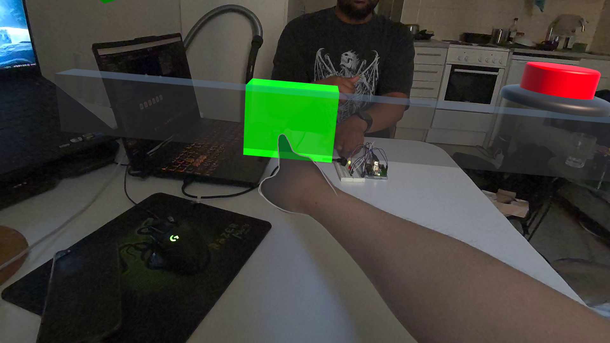
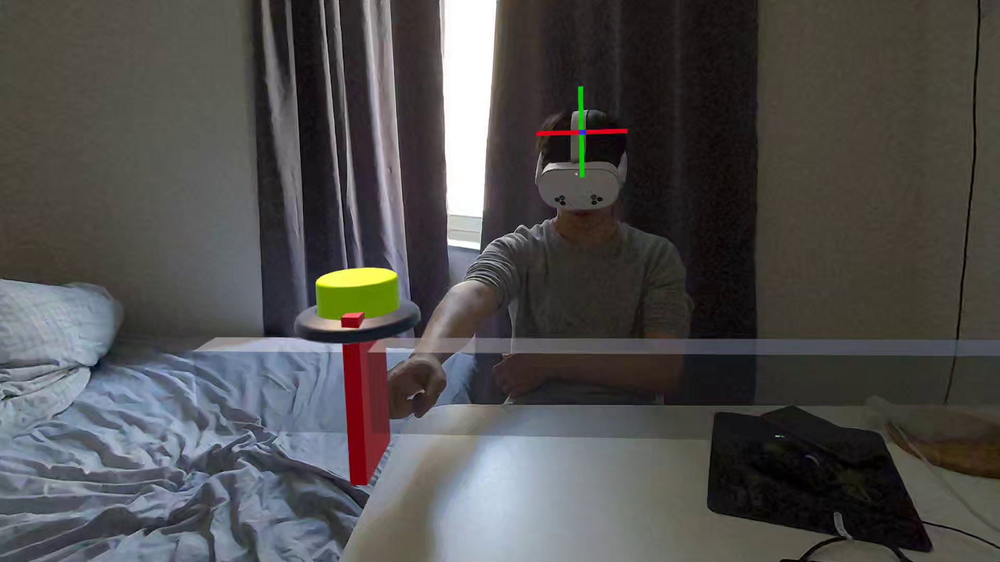
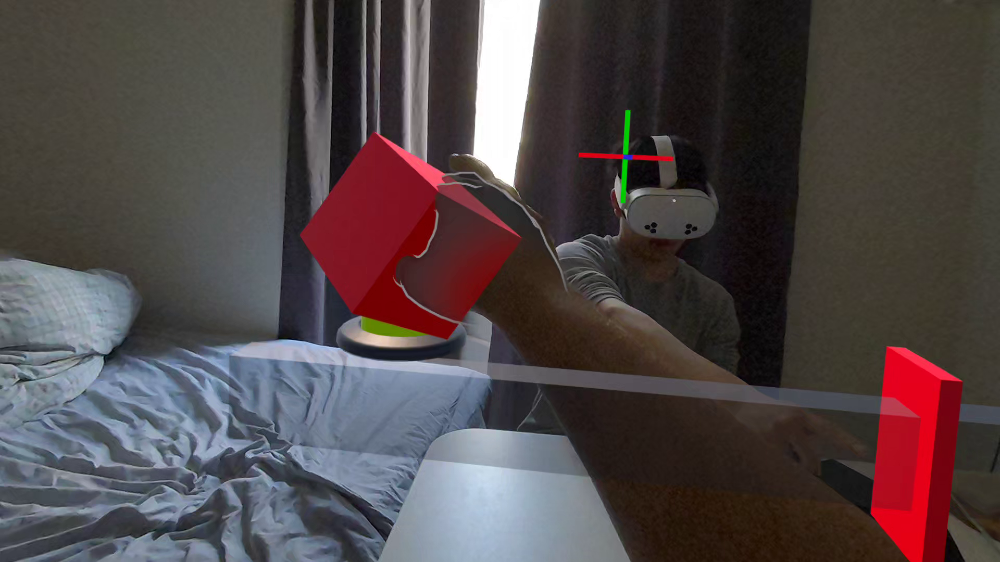
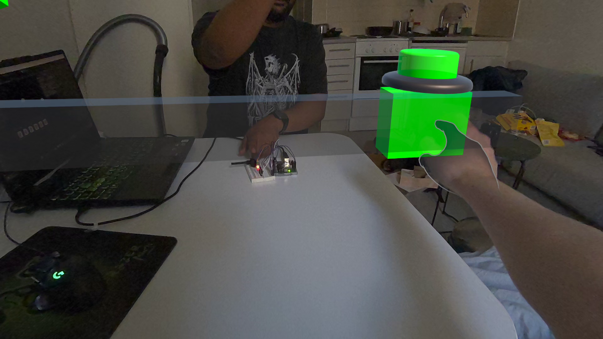
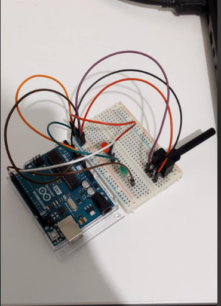

# Safety Override

Safety Override is a collocated mixed reality game built for Meta Quest headsets. Two users sit at the same table, each wearing a headset, and they see different virtual objects depending on their role. The project runs on Unity with Photon Fusion for networking and an Arduino for physical input and output.

## Introduction

Safety Override is inspired by [Keep Talking and Nobody Explodes](https://keeptalkinggame.com/), a game where one player sees a bomb and the other has a manual with defusal instructions. Neither player can complete the task alone and they must communicate constantly. Safety Override takes that same asymmetric collaboration concept and brings it into collocated mixed reality, where both players are inside the experience together, sitting at the same physical table, sharing the same virtual space.

One person plays as the supervisor and the other as the technician. The supervisor has a gauge with a green zone that keeps moving, and a difficulty cube that controls how fast the green zone moves. The technician has a physical knob (Arduino potentiometer) that controls a needle on the gauge. The technician needs to line up the needle with the green zone based on the supervisor's verbal guidance, then poke a virtual button to confirm. This message from the technician is carried to the supervisor via the Fusion network and the supervisor receives visual feedback by the change of button color from red to green on the supervisor's side. After that the supervisor presses the button. If the needle is inside the green zone, the Arduino lights up green, otherwise it lights up red.

The project was built to explore how far the combination of mixed reality, networking, hand tracking, and physical hardware can be pushed into one shared experience. The game adds time pressure because the green zone keeps moving, so both players have to communicate and act fast.

## Design Process

### Inspiration

The asymmetric collaboration design was directly inspired by [Keep Talking and Nobody Explodes](https://keeptalkinggame.com/). In that game, one player sees a bomb and the other has a manual with defusal instructions. Neither player can complete the task alone. Safety Override follows the same principle where the supervisor sees the target zone and guides the technician, while the technician operates the physical controls but cannot see where to aim without the supervisor's direction. The key difference is that in Safety Override, both players are inside the same mixed reality experience, seeing virtual objects overlaid on the real world, sitting face to face at the same table.

### Goals

The project set out to achieve the following:

- Get two people into the same physical space with collocated MR
- Give each person a different role with their own set of virtual objects
- Use a real physical device (Arduino with a potentiometer and LED) instead of keeping everything virtual
- Make the interaction feel natural by using hand tracking instead of controllers

### Challenges and Solutions

**Colocation was the hardest part.**
The project originally attempted to use Meta's Colocation Discovery API to align both headsets automatically. But it kept throwing error code -1002 and no fix could be found despite extensive troubleshooting. The project then used a manual calibration approach as a fallback, where each user presses a button and content appears relative to their head position. Eventually, Meta's shared spatial anchors were implemented successfully, which automatically aligns both headsets to a shared coordinate system. The first headset creates a spatial anchor, and the second headset receives it through the colocation system, so both users see the virtual content at the same physical location without any manual calibration step.

**Handling role based visibility.**
Instead of spawning separate objects for each player, all the game objects already exist in the scene. When a player connects, the code just turns on or off the relevant objects based on whether they are the host (supervisor) or client (technician). This keeps the networking simple because all the game state lives on one NetworkObject.

**Why hand tracking instead of controllers?**
For the supervisor, pointing at the gauge with your actual finger feels way more natural than using a controller joystick. For the technician, they already have a physical knob to turn, so using a controller on top of that would be unnecessary. Hand tracking activates automatically once the users wave their hands in front of the headsets.

**Why automatic role assignment instead of a role selection screen?**
The project uses Photon Fusion's AutoHostOrClient mode which automatically makes the first device to connect the host (supervisor) and the second device the client (technician). This removes the need for a menu or role selection UI. Since both users are sitting at the same table, they can simply agree beforehand on who launches first. Adding a role selection screen would mean extra UI, extra networking logic to sync the choices, and extra complexity that does not add any real value in a two person seated scenario where the users can just talk to each other.

**Why a physical potentiometer instead of a virtual slider?**
Turning a real knob gives more precise control than dragging a virtual slider in the air. Having something physical in your hands makes the experience more tangible and grounded. Plus it demonstrates hardware integration which was one of the goals of the project.

**The button color problem**
This one took a while to figure out. The Meta Interaction SDK has a component called `InteractableDebugVisual` that keeps overriding the button's material color whenever the button state changes. So no matter what color was set in code, it would get overwritten. The fix was to create separate materials (red, green, yellow) and swap the entire material at runtime using `renderer.sharedMaterial`. That way it does not matter what the SDK tries to do with the color because the whole material is different.

**Why audio feedback on button pokes?**
The virtual buttons have a poke sound effect wired to them. Over the Fusion network, button pokes do not always register smoothly and there is no visual animation that clearly shows a press happened. The audio feedback acts as confirmation that the button was actually pressed. Without it, users would be unsure whether their poke went through or not. Background music or ambient sound was not added because the game depends on verbal communication between the supervisor and technician, and background audio would interfere with that.

**Face to face mirroring**
When two people sit across from each other, their left and right are flipped. So if the supervisor sees the green zone on their left, the technician should also see it on their left from their own perspective. The collocated setup with both users viewing the same gauge from opposite sides naturally creates this anti-mirror behavior without any code-level coordinate negation.

## Features and Functionalities

### Collocated Mixed Reality
- Two users share the same physical table wearing Meta Quest headsets
- Virtual objects show up on top of the real environment through passthrough
- Both headsets align automatically through Meta's shared spatial anchors, so both users see the virtual content at the same physical location

### Role Based Gameplay
- **Supervisor (Host):** Sees the gauge with a moving green zone, a confirm button, and a difficulty cube that controls the speed of the green zone

*Supervisor's View*
- **Technician (Client):** Sees the same gauge but with a needle that they control with the Arduino potentiometer, plus a yellow confirmation button

*Technician's View*

### Moving Green Zone
- The green zone moves back and forth along the gauge in a sine wave pattern
- The speed is controlled by the difficulty cube which the supervisor can move
- Both the speed range and the zone width can be changed in the Unity Inspector

### Difficulty Cube
- A grabbable cube that the supervisor can move along the X axis
- Its position controls the speed of the green zone oscillation
- The cube changes color from green (easy/slow) to red (hard/fast) based on its position
- Gives the supervisor real-time control over the game's difficulty

*Difficulty cube held by the technician (turns red at max difficulty)*

### Client Confirmation System
- The technician pokes a yellow button with their hand when they think the needle is in the right spot
- This sends a network event and the supervisor's button turns from red to green
- Then the supervisor can press their button to check the result

*Supervisor's button turns green after technician confirms*

### Arduino Hardware Integration
- A physical potentiometer controls the needle position through serial communication
- The Arduino LED gives real feedback: green means success, red means failure
- The serial data goes through the Ardity library in Unity
- The potentiometer values get sent to all connected clients through Photon Fusion RPCs
- Serial communication runs at 115200 baud rate, with potentiometer values sent every 20ms

**Wiring:**

| Component | Arduino Pin |
|---|---|
| Potentiometer signal (middle pin) | A0 |
| Green LED (+) | Digital pin 2 |
| Red LED (+) | Digital pin 3 |
| Potentiometer outer pins | 5V and GND |
| LED ground legs | GND (through resistor) |


*Arduino hardware setup*

## Installation

### Prerequisites

| Requirement | Version |
|---|---|
| Unity | 6000.2.10f1 |
| Target Platform | Android (Meta Quest) |
| Meta XR SDK | 83.0.1 |
| Photon Fusion | 2 (imported via .unitypackage) |
| Ardity | Included in `Assets/Ardity/` |
| Arduino IDE | For uploading the sketch to the Arduino board |

### Hardware Required

- 2 Meta Quest headsets (Quest 2, Quest Pro, Quest 3, or Quest 3S)
- 1 Arduino board with a potentiometer and 2 LEDs (Red and Green)
- 1 PC running Unity Editor (this acts as the Arduino serial bridge)
- All devices need to be on the same Wi-Fi network

### Setup Steps

1. **Clone the repository:**
   ```
   git clone <https://github.com/sakib13/SafetyOverride.git>
   ```

2. **Open in Unity:**
   - Open Unity Hub and add the project
   - Make sure you are using Unity version **6000.2.10f1**
   - Open `Assets/Scenes/SampleScene.unity`

3. **Photon Fusion App ID:**
   - Go to [Photon Dashboard](https://dashboard.photonengine.com/) and create a Fusion app
   - In Unity go to `Fusion > Fusion Hub > Setup` and paste your App ID

4. **Arduino Setup:**
   - Upload the Arduino sketch to your board (potentiometer on A0, green LED on pin 2, red LED on pin 3)
   - Set the baud rate to **115200** in the Arduino sketch
   - Connect the Arduino to the PC with USB
   - In Unity, set the correct COM port on the `SerialController` component in the scene

5. **Build for Quest:**
   - Go to `File > Build Settings`
   - Select **Android** platform
   - Connect your Quest headset via USB or wireless ADB
   - Click **Build and Run**

## Usage

### Physical Setup

1. Place a table in the middle with two chairs on opposite sides, facing each other
2. The Arduino board with the potentiometer and LEDs should be placed on the table within arm's reach of the technician's seat
3. The Arduino connects via USB to the PC, which should be nearby on or beside the table
4. Both Quest headsets should be charged and connected to the same Wi-Fi network as the PC
5. Each user sits in their chair and puts on their headset before launching the app

### Starting a Session

1. Launch the app on the first Quest headset. This device becomes the Host and takes the Supervisor role.
2. Launch the app on the second Quest headset. This one joins as the Client and takes the Technician role.
3. Hit Play in the Unity Editor on the PC. This connects as a third client and handles the Arduino serial communication.

### Colocation

1. Both headset users sit at opposite sides of a table
2. The first headset to launch creates a shared spatial anchor
3. The second headset automatically receives the anchor and aligns to the same coordinate system
4. Both users now see the virtual content at the same physical location on the table
5. Users wave their hands in front of the headsets to activate hand tracking

### Gameplay Flow

1. The green zone starts moving along the gauge
2. The supervisor verbally guides the technician, telling them which direction to move the needle
3. The supervisor can grab and move the difficulty cube to adjust how fast the green zone moves
4. The technician turns the physical potentiometer to move the needle
5. When the technician thinks the needle is lined up, they poke the yellow button
6. The supervisor's button turns green, meaning the technician is ready
7. The supervisor pokes their confirm button
8. If the needle is inside the green zone the Arduino LED lights up green. If not, it lights up red.
9. The whole thing repeats

### Configurable Parameters

| Parameter | Location | Default | Description |
|---|---|---|---|
| Green Zone Speed | DigitalTwin > SafetyGameManager | 0.3 | How fast the green zone moves |
| Zone Width | DigitalTwin > SafetyGameManager | 0.15 | How wide the green zone is |

### Best Practices
  1. Both users should sit upright at the table. The shared spatial anchor aligns content to a fixed physical location, so consistent seating helps ensure the virtual objects appear at the expected position.
  2. Users should face each other directly across the table, not at an angle. The face to face layout assumes both users are looking straight at each other, so sitting off to one side can cause the needle positions to look misaligned.
  3. The table surface should be clear of clutter so the physical potentiometer is easy to reach and both users have room to use hand tracking comfortably.
  4. Both headsets should be connected to the same Wi-Fi network before launching the app. If one headset connects to a different network, they will not find each other in the Photon session.
  5. The supervisor should launch the app first. The first device to connect becomes the host and creates the spatial anchor. The second device joins as the client and receives the anchor.

## Project Structure

```
Assets/
├── Scenes/
│   └── SampleScene.unity          # Main scene
├── Scripts/
│   ├── ConnectionManager.cs       # Photon Fusion networking setup
│   ├── ManualCalibrationManager.cs# Manual spatial calibration
│   ├── SafetyGameManager.cs       # Core game logic, role visibility, green zone
│   ├── SupervisorLaser.cs         # Networked hand tracked laser pointer
│   └── TwinController.cs          # Arduino serial communication bridge
├── Materials/
│   ├── ButtonRed.mat              # Supervisor button default
│   ├── ButtonGreen.mat            # Supervisor button when client confirmed
│   └── ButtonYellow.mat           # Client button
├── Ardity/                        # Serial communication library
│   ├── Scripts/
│   └── Prefabs/
└── Photon/
    └── Fusion/                    # Photon Fusion networking SDK
```

### Scene Hierarchy

```
[BuildingBlock] Camera Rig         OVRCameraRig with Eye Level tracking
GameContent                        Parent for all game objects
  ├── LinearGauge                  The gauge
  │   ├── Track                    Gauge background
  │   ├── GreenZone                Moving target zone (networked)
  │   └── Needle                   Arduino controlled indicator
  ├── [BuildingBlock] Cube         Difficulty cube (controls green zone speed)
  ├── BigRedButton                 Supervisor's confirm button
  └── ClientYellowButton           Technician's confirm button
ColocationManager                  Shared spatial anchor colocation
[BuildingBlock] Network Manager    ConnectionManager + Photon NetworkRunner
DigitalTwin                        SafetyGameManager + SupervisorLaser + NetworkObject
ArduinoManager                     TwinController + SerialController
```


## References

- [Photon Fusion 2 Documentation](https://doc.photonengine.com/fusion/current/getting-started/fusion-intro) for the networking framework
- [Meta XR SDK Documentation](https://developer.oculus.com/documentation/unity/unity-overview/) for the MR platform
- [Meta Interaction SDK](https://developer.oculus.com/documentation/unity/unity-isdk-interaction-sdk-overview/) for hand tracking and poke interactions
- [Ardity](https://github.com/DWilches/Ardity) for Arduino to Unity serial communication
- [Unity Universal Render Pipeline](https://docs.unity3d.com/Packages/com.unity.render-pipelines.universal@17.0/manual/index.html) for rendering
- [Keep Talking and Nobody Explodes](https://keeptalkinggame.com/) for the asymmetric gameplay inspiration

## License

This project was developed as part of a university course assignment at Stockholm University. It is intended for educational and demonstration purposes only and is not licensed for commercial use.

## Contributors

Design, development, and implementation - Sakib Ahsan Dipto |
MSc in Design for Creative and Immersive Technology, Stockholm University

Contact: sakibahsandipto@gmail.com
