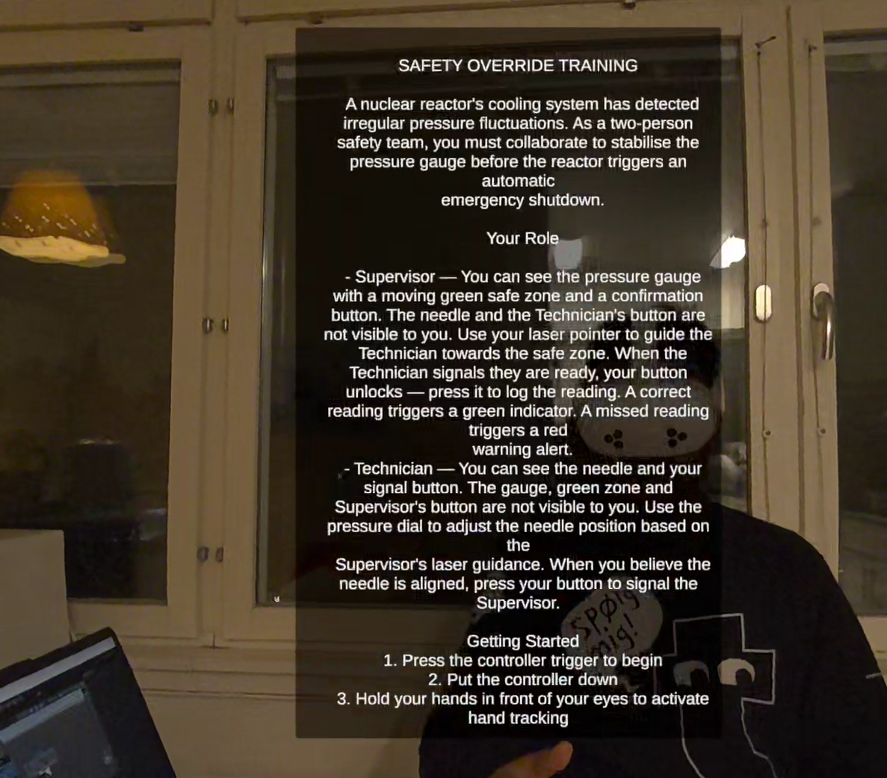

# Safety Override

Safety Override is a collocated mixed reality training simulation built for Meta Quest headsets. Two users sit at the same table, each wearing a headset, and they see different virtual objects depending on their role. The project runs on Unity with Photon Fusion for networking and an Arduino for physical input and output.

## Introduction

The concept behind Safety Override is a nuclear power reactor training scenario. One person plays as the supervisor and the other as the technician. Both sit at the same physical table and see virtual objects through mixed reality passthrough, but each person sees different things based on their role.

The supervisor has a pressure gauge with a green zone that keeps moving, and they can point at it with a laser that comes from their hand. The technician has a physical knob (Arduino potentiometer) that controls a needle on the gauge. The technician needs to line up the needle with the green zone, then poke a virtual button to confirm. This message from host is carried to the supervisor via fusion network and the supevisor receives a visual feedback by change of button's color from Red to Green on supervisor's side. After that the supervisor presses the button. If the needle is inside the green zone at the right time before green zone starts moving again, the Arduino lights up green, otherwise it lights up red. The physical LED response brings the training outcome into the real world, reflecting how actual safety critical environments rely on tangible hardware indicators rather than virtual displays to communicate operational status.

The project was built to explore how far the combination of mixed reality, networking, hand tracking, and physical hardware can be pushed into one shared experience. The training scenario adds time pressure because the green zone keeps moving and pausing randomly, so both players have to communicate and act fast.

## Design Process

### Inspiration

The training scenario was inspired by how real nuclear power plants use [full scope control room simulators](https://www.iaea.org/topics/nuclear-power-reactors/nuclear-reactor-simulators-for-education-and-training) to train operators in a safe environment before they handle actual equipment. The project takes that same idea and brings it into mixed reality, where the virtual gauge and physical potentiometer stand in for the control panel instruments that operators would interact with during training.

The asymmetric collaboration design was inspired by [Keep Talking and Nobody Explodes](https://keeptalkinggame.com/), a game where one player sees a bomb and the other has a manual with defusal instructions. Neither player can complete the task alone and they must communicate constantly. Safety Override follows the same principle where the supervisor sees the target zone and guides the technician, while the technician operates the physical controls but cannot see where to aim without the supervisor's direction.

### Goals

The project set out to achieve the following:

- Get two people into the same physical space with collocated MR
- Give each person a different role with their own set of virtual objects
- Use a real physical device (Arduino with a potentiometer and LED) instead of keeping everything virtual
- Make the interaction feel natural by using hand tracking instead of controllers

### Challenges and Solutions

**Colocation was the hardest part.**
The project originally attempted to use Meta's Colocation Discovery API to align both headsets automatically. But it kept throwing error code 1002 and no fix could be found despite extensive troubleshooting. So the project went with a manual approach instead. Each user presses a button on their controller and the game content gets placed in front of them relative to where their head is. It is simple but it works. The downside is both users need to roughly face the same direction when they calibrate, but since they are sitting at a table this is not really a problem.

**Why manual calibration and not shared spatial anchors?**
Because the API was broken and the project needed something that works reliably every time. Manual calibration is more predictable. You press a button, content appears in front of you. No dependency on Meta's cloud services or anchor sharing. For a seated scenario at a table this approach works effectively.

**Handling role based visibility.**
Instead of spawning separate objects for each player, all the game objects already exist in the scene. When a player connects, the code just turns on or off the relevant objects based on whether they are the host (supervisor) or client (technician). This keeps the networking simple because all the game state lives on one NetworkObject.

**Why hand tracking instead of controllers?**
For the supervisor, pointing at the gauge with your actual finger feels way more natural than using a controller joystick (Consider in real scenario where a power plant supervisor is operating through interacting with touch screen digital device). For the technician, they already have a physical knob to turn, so using a controller on top of that would be unncecessary. Controllers are only used at the very beginning for the calibration step, and after that users put them down and switch to hand tracking.

**Why automatic role assignment instead of a role selection screen?**
The project uses Photon Fusion's AutoHostOrClient mode which automatically makes the first device to connect the host (supervisor) and the second device the client (technician). This removes the need for a
menu or role selection UI. Since both users are sitting at the same table, they can simply agree beforehand on who launches first. Adding a role selection screen would mean extra UI, extra networking logic
to sync the choices, and extra complexity that does not add any real value in a two person seated scenario where the users can just talk to each other

**Why a physical potentiometer instead of a virtual slider?**
Turning a real knob is more realistic in consideration with an actual nuclear power plant based scenario and gives more precise control than dragging a virtual slider in the air. In a nuclear power plant training simulation where tangibility matters, having something physical in your hands makes a big difference. Plus it demonstrates hardware integration which was one of the goals of the project.

**The button color problem**
This one took a while to figure out. The Meta Interaction SDK has a component called `InteractableDebugVisual` that keeps overriding the button's material color whenever the button state changes. So no matter what color was set in code, it would get overwritten. The fix was to create separate materials (red, green, yellow) and swap the entire material at runtime using `renderer.sharedMaterial`. That way it does not matter what the SDK tries to do with the color because the whole material is different.

**Why audio feedback on button pokes?**
The virtual buttons have a poke sound effect wired to them. Over the Fusion network, button pokes do not always register smoothly and there is no visual animation that clearly shows a press happened. The audio feedback acts as confirmation that the button was actually pressed. Without it, users would be unsure whether their poke went through or not. Background music or ambient sound was not added because the training scenario depends on verbal communication between the supervisor and technician, and background audio would interfere with that.

**Face to face mirroring**
When two people sit across from each other, their left and right are flipped. So if the supervisor sees the green zone on their left, the technician should also see it on their left from their own perspective. To fix this the project negates the X position of the needle on the client side. The laser pointer also gets its X coordinate flipped so both users see it pointing at the same spot on the gauge.

## Features and Functionalities

### Collocated Mixed Reality
- Two users share the same physical table wearing Meta Quest headsets
- Virtual objects show up on top of the real environment through passthrough
- Each user calibrates by pressing a button of the right controller and content appears at table height in front of them

### Role Based Gameplay
- **Supervisor (Host):** Sees the pressure gauge with a moving green zone, a confirm button, and a red laser that follows their right hand

*Supervisor's View*
- **Technician (Client):** Sees the same gauge but with a needle that they control with the Arduino potentiometer, plus a yellow confirmation button

*Client's View*

### Moving Green Zone
- The green zone moves back and forth along the gauge in a sine wave pattern
- It randomly stops for a few seconds then starts moving again, which adds time pressure
- Both the speed and the pause duration can be changed in the Unity Inspector

### Supervisor Laser Pointer
- A red laser line extends from the supervisor's right hand
- It uses Meta Quest hand tracking so no controller is needed
- Both users can see the laser through Photon Fusion networking
- The X position gets flipped for the client so it looks correct from their side of the table

### Client Confirmation System
- The technician pokes a yellow button with their hand when they think the needle is in the right spot
- This sends a network event and the supervisor's button turns from red to green
- Then the supervisor can press their button to check the result

*Supervisor can now press the button to check status*

### Arduino Hardware Integration
- A physical potentiometer controls the needle position through serial communication
- The Arduino LED gives real feedback: green means success, red means failure
- The serial data goes through the Ardity library in Unity
- The potentiometer values get sent to all connected clients through Photon Fusion RPCs
- Serial communication runs at 115200 baud rate, with potentiometer values sent every 20ms

**Wiring:**

| Component | Arduino Pin |
|---|---|
| Potentiometer signal (middle pin) | A0 |
| Green LED (+) | Digital pin 2 |
| Red LED (+) | Digital pin 3 |
| Potentiometer outer pins | 5V and GND |
| LED ground legs | GND (through resistor) |


*Arduino hardware setup*

### Instruction Canvas
- Before calibration, a floating canvas shows up in front of the user
- It explains the game story and gives step by step instructions for both roles
- It disappears once the user calibrates with the controller

*Story narrative/Instruction window before calibration*

## Installation

### Prerequisites

| Requirement | Version |
|---|---|
| Unity | 6000.2.10f1 |
| Target Platform | Android (Meta Quest) |
| Meta XR SDK | 83.0.1 |
| Photon Fusion | 2 (imported via .unitypackage) |
| Ardity | Included in `Assets/Ardity/` |
| Arduino IDE | For uploading the sketch to the Arduino board |

### Hardware Required

- 2 Meta Quest headsets (Quest 2, Quest Pro, Quest 3, or Quest 3S)
- 1 Arduino board with a potentiometer and 2 LEDs (Red and Green)
- 1 PC running Unity Editor (this acts as the Arduino serial bridge)
- All devices need to be on the same Wi-Fi network

### Setup Steps

1. **Clone the repository:**
   ```
   git clone <https://github.com/sakib13/SafetyOverride.git>
   ```

2. **Open in Unity:**
   - Open Unity Hub and add the project
   - Make sure you are using Unity version **6000.2.10f1**
   - Open `Assets/Scenes/SampleScene.unity`

3. **Photon Fusion App ID:**
   - Go to [Photon Dashboard](https://dashboard.photonengine.com/) and create a Fusion app
   - In Unity go to `Fusion > Fusion Hub > Setup` and paste your App ID

4. **Arduino Setup:**
   - Upload the Arduino sketch to your board (potentiometer on A0, green LED on pin 2, red LED on pin 3)
   - Set the baud rate to **115200** in the Arduino sketch
   - Connect the Arduino to the PC with USB
   - In Unity, set the correct COM port on the `SerialController` component in the scene

5. **Build for Quest:**
   - Go to `File > Build Settings`
   - Select **Android** platform
   - Connect your Quest headset via USB or wireless ADB
   - Click **Build and Run**

## Usage

### Physical Setup

1. Place a table in the middle with two chairs on opposite sides, facing each other
2. The Arduino board with the potentiometer and LEDs should be placed on the table within arm's reach of the technician's seat
3. The Arduino connects via USB to the PC, which should be nearby on or beside the table
4. Both Quest headsets should be charged and connected to the same Wi-Fi network as the PC
5. Each user sits in their chair and puts on their headset before launching the app

### Starting a Session

1. Launch the app on the first Quest headset. This device becomes the Host and takes the Supervisor role.
2. Launch the app on the second Quest headset. This one joins as the Client and takes the Technician role.
3. Hit Play in the Unity Editor on the PC. This connects as a third client and handles the Arduino serial communication.
4. The supervisor will then press space bar on keyboard for the arduino to become actiavated and to send serial commands.

### Calibration

1. Both headset users sit at opposite sides of a table
2. Each user presses the **right trigger** on their controller
3. The game content shows up at table height in front of each user
4. After that, suers can put down their controllers and wave their hand infront of the headsets while they're into mixed reality for the hand tracking to get activated. 

### Gameplay Flow

1. The green zone starts moving along the gauge
2. The supervisor points at the gauge with their right hand to show the technician where to aim
3. The supervisor uses a red laser that extends from their right hand to point at the target area on the gauge, guiding the technician toward the green zone
4. The technician turns the physical potentiometer to move the needle
5. When the technician thinks the needle is lined up, they poke the yellow button
6. The supervisor's button turns green, meaning the technician is ready
7. The supervisor pokes their confirm button
8. If the needle is inside the green zone the Arduino LED lights up green. If not, it lights up red.
9. The whole thing repeats

### Configurable Parameters

| Parameter | Location | Default | Description |
|---|---|---|---|
| Green Zone Speed | DigitalTwin > SafetyGameManager | 0.3 | How fast the green zone moves |
| Pause Duration | DigitalTwin > SafetyGameManager | 5.0 | How long the green zone stops for (seconds) |
| Zone Width | DigitalTwin > SafetyGameManager | 0.15 | How wide the green zone is |
| Laser Length | DigitalTwin > SupervisorLaser | 3.0 | How far the laser extends |
| Laser Width | DigitalTwin > SupervisorLaser | 0.005 | How thick the laser line is |
| Content Distance | CalibrationManager | 0.5 | How far from the head the content appears (meters) |
| Height Offset | CalibrationManager | -0.3 | How far below eye level the content sits |

### Best Practices
  1. Both users should sit upright with a straight posture when pressing the calibration button. Since the game content is placed relative to the head position, slouching or leaning can cause the virtual
  objects to appear at an incorrect height or angle.
  2. Users should face each other directly across the table, not at an angle. The face to face mirroring logic assumes both users are looking straight at each other, so sitting off to one side can cause the
  laser and needle positions to look misaligned.
  3. The table surface should be clear of clutter so the physical potentiometer is easy to reach and both users have room to use hand tracking comfortably.
  4. Both headsets should be connected to the same Wi-Fi network before launching the app. If one headset connects to a different network, they will not find each other in the Photon session.
  5. The supervisor should launch the app first and complete calibration before the technician launches. The first device to connect becomes the host and the second becomes the client.

## Project Structure

```
Assets/
├── Scenes/
│   └── SampleScene.unity          # Main scene
├── Scripts/
│   ├── ConnectionManager.cs       # Photon Fusion networking setup
│   ├── ManualCalibrationManager.cs# Manual spatial calibration
│   ├── SafetyGameManager.cs       # Core game logic, role visibility, green zone
│   ├── SupervisorLaser.cs         # Networked hand tracked laser pointer
│   └── TwinController.cs          # Arduino serial communication bridge
├── Materials/
│   ├── ButtonRed.mat              # Supervisor button default
│   ├── ButtonGreen.mat            # Supervisor button when client confirmed
│   └── ButtonYellow.mat           # Client button
├── Ardity/                        # Serial communication library
│   ├── Scripts/
│   └── Prefabs/
└── Photon/
    └── Fusion/                    # Photon Fusion networking SDK
```

### Scene Hierarchy

```
[BuildingBlock] Camera Rig         OVRCameraRig with Eye Level tracking
GameContent                        Parent for all game objects (moved by calibration)
  ├── LinearGauge                  The pressure gauge
  │   ├── Track                    Gauge background
  │   ├── GreenZone                Moving target zone (networked)
  │   └── Needle                   Arduino controlled indicator
  ├── BigRedButton                 Supervisor's confirm button
  └── ClientYellowButton           Technician's confirm button
CalibrationManager                 ManualCalibrationManager component
[BuildingBlock] Network Manager    ConnectionManager + Photon NetworkRunner
DigitalTwin                        SafetyGameManager + SupervisorLaser + NetworkObject
ArduinoManager                     TwinController + SerialController
```


## References

- [Photon Fusion 2 Documentation](https://doc.photonengine.com/fusion/current/getting-started/fusion-intro) for the networking framework
- [Meta XR SDK Documentation](https://developer.oculus.com/documentation/unity/unity-overview/) for the VR platform
- [Meta Interaction SDK](https://developer.oculus.com/documentation/unity/unity-isdk-interaction-sdk-overview/) for hand tracking and poke interactions
- [Ardity](https://github.com/DWilches/Ardity) for Arduino to Unity serial communication
- [Unity Universal Render Pipeline](https://docs.unity3d.com/Packages/com.unity.render-pipelines.universal@17.0/manual/index.html) for rendering

## License

This project was developed as part of a university course assignment at Stockholm University. It is intended for educational and demonstration purposes only and is not licensed for commercial use.

## Contributors

Design, development, and implementation - Sakib Ahsan Dipto |
MSc in Design for Creative and Immersive Technology, Stockholm University

Contact: sakibahsandipto@gmail.com

--------
ADB stuffs 

--------- beginning of main
05-10 23:25:42.293 16640 16640 V Unity   : Context Type: GameActivity
05-10 23:25:42.299 16640 16669 I Unity   : UnityApplication::CreateInstance
05-10 23:25:42.299 16640 16669 I Unity   : GameActivity Package Version '3.0.5'
05-10 23:25:42.301 16640 16669 I Unity   : Starting Game Loop
05-10 23:25:42.303 16640 16669 I Unity   : Handle cmd APP_CMD_START(11)
05-10 23:25:42.306 16640 16669 I Unity   : Handle cmd APP_CMD_RESUME(12)
05-10 23:25:42.313 16640 16669 I Unity   : Handle cmd APP_CMD_GAINED_FOCUS(7)
05-10 23:25:42.313 16640 16669 I Unity   : Handle cmd APP_CMD_LOST_FOCUS(8)
05-10 23:25:42.315 16640 16669 I Unity   : Handle cmd APP_CMD_WINDOW_INSETS_CHANGED(17)
05-10 23:25:42.320 16640 16669 I Unity   : Handle cmd APP_CMD_WINDOW_INSETS_CHANGED(17)
05-10 23:25:42.320 16640 16669 I Unity   : Handle cmd APP_CMD_WINDOW_INSETS_CHANGED(17)
05-10 23:25:42.320 16640 16669 I Unity   : Handle cmd APP_CMD_WINDOW_INSETS_CHANGED(17)
05-10 23:25:42.320 16640 16669 I Unity   : Handle cmd APP_CMD_CONTENT_RECT_CHANGED(5)
05-10 23:25:42.322 16640 16669 I Unity   : Handle cmd APP_CMD_INIT_WINDOW(1)
05-10 23:25:42.333 16640 16669 I Unity   : MemoryManager: Using 'Dynamic Heap' Allocator.
05-10 23:25:42.353 16640 16669 I Unity   : SystemInfo CPU = ARM64 FP ASIMD AES, Cores = 6, Memory = 7756mb
05-10 23:25:42.353 16640 16669 I Unity   : SystemInfo ARM big.LITTLE configuration: 4 big (mask: 0x3c), 2 little (mask: 0x3)
05-10 23:25:42.353 16640 16669 I Unity   : XR UsableCoreMask: 0x3f
05-10 23:25:42.353 16640 16669 I Unity   : ApplicationInfo 'com.sakib.dcdc', Version '0.1.0', Min API Level '32', Target API Level '32'
05-10 23:25:42.353 16640 16669 I Unity   : Built from '6000.2/staging' branch, Version '6000.2.10f1 (d3d30d158480)', Build type 'Release', Scripting Backend 'il2cpp', CPU 'arm64-v8a', Stripping 'Enabled'
05-10 23:25:42.353 16640 16669 I Unity   : Device Model 'Oculus Quest 3', OS 'Android OS 14 (API 34)'
05-10 23:25:42.600 16640 16669 I Unity   : Unity memory allocator detected: MetaXRAudio native memory allocations will be tracked.
05-10 23:25:42.602 16640 16669 I Unity   : Company Name: GlitchVein
05-10 23:25:42.602 16640 16669 I Unity   : Product Name: SafetyOverride
05-10 23:25:42.604 16640 16669 D Unity   : loading library OVRPlugin
05-10 23:25:43.033 16640 16669 I Unity   : XRGeneral Settings awakening...
05-10 23:25:43.033 16640 16669 I Unity   : UnityEngine.DebugLogHandler:Internal_Log(LogType, LogOption, String, Object)
05-10 23:25:43.033 16640 16669 I Unity   : UnityEngine.XR.Management.XRGeneralSettings:Awake()
05-10 23:25:43.033 16640 16669 I Unity   : 
05-10 23:25:43.257 16640 16669 I Unity   :     HasWindow = 1, HasFocus = 0
05-10 23:25:43.257 16640 16669 I Unity   : Handle cmd APP_CMD_WINDOW_RESIZED(3)
05-10 23:25:43.258 16640 16669 I Unity   : Handle cmd APP_CMD_WINDOW_REDRAW_NEEDED(4)
05-10 23:25:43.258 16640 16669 I Unity   : Handle cmd APP_CMD_WINDOW_INSETS_CHANGED(17)
05-10 23:25:43.258 16640 16669 I Unity   : Handle cmd APP_CMD_WINDOW_INSETS_CHANGED(17)
05-10 23:25:43.258 16640 16669 I Unity   : Handle cmd APP_CMD_GAINED_FOCUS(7)
05-10 23:25:43.258 16640 16669 I Unity   : Handle cmd APP_CMD_WINDOW_INSETS_CHANGED(17)
05-10 23:25:43.258 16640 16669 I Unity   : Handle cmd APP_CMD_WINDOW_INSETS_CHANGED(17)
05-10 23:25:43.258 16640 16669 I Unity   : Handle cmd APP_CMD_WINDOW_INSETS_CHANGED(17)
05-10 23:25:43.258 16640 16669 I Unity   : Handle cmd APP_CMD_WINDOW_INSETS_CHANGED(17)
05-10 23:25:43.258 16640 16669 I Unity   : Handle cmd APP_CMD_WINDOW_INSETS_CHANGED(17)
05-10 23:25:43.425 16640 16669 D Unity   : initOculus Java!
05-10 23:25:43.425 16640 16640 D Unity   : Oculus UI thread done.
05-10 23:25:43.444 16640 16669 W Unity   : MRUK Shared: Unable to bind OpenXR function
05-10 23:25:43.444 16640 16669 W Unity   : UnityEngine.DebugLogHandler:Internal_Log(LogType, LogOption, String, Object)
05-10 23:25:43.444 16640 16669 W Unity   : Meta.XR.MRUtilityKit.MRUK:OnSharedLibLog(MrukLogLevel, Char*, UInt32)
05-10 23:25:43.444 16640 16669 W Unity   : Meta.XR.MRUtilityKit.MRUK:InitializeSharedLibrary()
05-10 23:25:43.444 16640 16669 W Unity   : 
05-10 23:25:43.444 16640 16669 W Unity   : MRUK Shared: Unable to bind OpenXR function
05-10 23:25:43.444 16640 16669 W Unity   : UnityEngine.DebugLogHandler:Internal_Log(LogType, LogOption, String, Object)
05-10 23:25:43.444 16640 16669 W Unity   : Meta.XR.MRUtilityKit.MRUK:OnSharedLibLog(MrukLogLevel, Char*, UInt32)
05-10 23:25:43.444 16640 16669 W Unity   : Meta.XR.MRUtilityKit.MRUK:InitializeSharedLibrary()
05-10 23:25:43.444 16640 16669 W Unity   : 
05-10 23:25:43.444 16640 16669 W Unity   : MRUK Shared: Unable to bind OpenXR function
05-10 23:25:43.444 16640 16669 W Unity   : UnityEngine.DebugLogHandler:Internal_Log(LogType, LogOption, String, Object)
05-10 23:25:43.444 16640 16669 W Unity   : Meta.XR.MRUtilityKit.MRUK:OnSharedLibLog(MrukLogLevel, Char*, UInt32)
05-10 23:25:43.444 16640 16669 W Unity   : Meta.XR.MRUtilityKit.MRUK:InitializeSharedLibrary()
05-10 23:25:43.444 16640 16669 W Unity   : 
05-10 23:25:43.445 16640 16669 W Unity   : MRUK Shared: Unable to bind OpenXR function
05-10 23:25:43.445 16640 16669 W Unity   : UnityEngine.DebugLogHandler:Internal_Log(LogType, LogOption, String, Object)
05-10 23:25:43.445 16640 16669 W Unity   : Meta.XR.MRUtilityKit.MRUK:OnSharedLibLog(MrukLogLevel, Char*, UInt32)
05-10 23:25:43.445 16640 16669 W Unity   : Meta.XR.MRUtilityKit.MRUK:InitializeSharedLibrary()
05-10 23:25:43.445 16640 16669 W Unity   : 
05-10 23:25:43.445 16640 16669 W Unity   : MRUK Shared: Unable to bind OpenXR function
05-10 23:25:43.445 16640 16669 W Unity   : UnityEngine.DebugLogHandler:Internal_Log(LogType, LogOption, String, Object)
05-10 23:25:43.445 16640 16669 W Unity   : Meta.XR.MRUtilityKit.MRUK:OnSharedLibLog(MrukLogLevel, Char*, UInt32)
05-10 23:25:43.445 16640 16669 W Unity   : Meta.XR.MRUtilityKit.MRUK:InitializeSharedLibrary()
05-10 23:25:43.445 16640 16669 W Unity   : 
05-10 23:25:43.691 16640 16669 I Unity   : Applying Acoustic Propagation Settings: [acoustic model = Automatic], [diffraction = True], 
05-10 23:25:43.691 16640 16669 I Unity   : UnityEngine.DebugLogHandler:Internal_Log(LogType, LogOption, String, Object)
05-10 23:25:43.691 16640 16669 I Unity   : MetaXRAcousticSettings:ApplyAllSettings()
05-10 23:25:43.691 16640 16669 I Unity   : 
05-10 23:25:43.704 16640 16669 I Unity   : Meta XR Audio Native Interface initialized with Unity plugin
05-10 23:25:43.704 16640 16669 I Unity   : UnityEngine.DebugLogHandler:Internal_Log(LogType, LogOption, String, Object)
05-10 23:25:43.704 16640 16669 I Unity   : MetaXRAcousticNativeInterface:FindInterface()
05-10 23:25:43.704 16640 16669 I Unity   : MetaXRAcousticNativeInterface:get_Interface()
05-10 23:25:43.704 16640 16669 I Unity   : MetaXRAcousticSettings:ApplyAllSettings()
05-10 23:25:43.704 16640 16669 I Unity   : 
05-10 23:25:43.705 16640 16669 I Unity   : Setting spatial voice limit: 64
05-10 23:25:43.705 16640 16669 I Unity   : UnityEngine.DebugLogHandler:Internal_Log(LogType, LogOption, String, Object)
05-10 23:25:43.705 16640 16669 I Unity   : MetaXRAudioSource:OnBeforeSceneLoadRuntimeMethod()
05-10 23:25:43.705 16640 16669 I Unity   : 
05-10 23:25:43.717 16640 16669 I Unity   : Unity v6000.2.10f1, Oculus Utilities v1.115.0, OVRPlugin v1.115.0, SDK v1.1.51.
05-10 23:25:43.717 16640 16669 I Unity   : UnityEngine.DebugLogHandler:Internal_Log(LogType, LogOption, String, Object)
05-10 23:25:43.717 16640 16669 I Unity   : OVRManager:InitOVRManager()
05-10 23:25:43.717 16640 16669 I Unity   : 
05-10 23:25:43.718 16640 16669 I Unity   : SystemHeadset Meta_Quest_3, API OpenXR
05-10 23:25:43.718 16640 16669 I Unity   : UnityEngine.DebugLogHandler:Internal_Log(LogType, LogOption, String, Object)
05-10 23:25:43.718 16640 16669 I Unity   : OVRManager:InitOVRManager()
05-10 23:25:43.718 16640 16669 I Unity   : 
05-10 23:25:43.718 16640 16669 I Unity   : OpenXR instance 0x2 session 0x50
05-10 23:25:43.718 16640 16669 I Unity   : UnityEngine.DebugLogHandler:Internal_Log(LogType, LogOption, String, Object)
05-10 23:25:43.718 16640 16669 I Unity   : OVRManager:InitOVRManager()
05-10 23:25:43.718 16640 16669 I Unity   : 
05-10 23:25:43.720 16640 16669 I Unity   : OVRPlugin.Media not initialized
05-10 23:25:43.720 16640 16669 I Unity   : UnityEngine.DebugLogHandler:Internal_Log(LogType, LogOption, String, Object)
05-10 23:25:43.720 16640 16669 I Unity   : OVRManager:StaticInitializeMixedRealityCapture(OVRMixedRealityCaptureConfiguration)
05-10 23:25:43.720 16640 16669 I Unity   : OVRManager:InitOVRManager()
05-10 23:25:43.720 16640 16669 I Unity   : 
05-10 23:25:43.729 16640 16669 I Unity   : Current display frequency 90, available frequencies [72, 80, 90, 120]
05-10 23:25:43.729 16640 16669 I Unity   : UnityEngine.DebugLogHandler:Internal_Log(LogType, LogOption, String, Object)
05-10 23:25:43.729 16640 16669 I Unity   : OVRManager:InitOVRManager()
05-10 23:25:43.729 16640 16669 I Unity   : 
05-10 23:25:43.740 16640 16669 W Unity   : Local Dimming feature is not supported
05-10 23:25:43.740 16640 16669 W Unity   : UnityEngine.DebugLogHandler:Internal_Log(LogType, LogOption, String, Object)
05-10 23:25:43.740 16640 16669 W Unity   : OVRManager:InitOVRManager()
05-10 23:25:43.740 16640 16669 W Unity   : 
05-10 23:25:43.742 16640 16669 I Unity   : [OVRManager] Current hand skeleton version is OpenXR
05-10 23:25:43.742 16640 16669 I Unity   : UnityEngine.DebugLogHandler:Internal_Log(LogType, LogOption, String, Object)
05-10 23:25:43.742 16640 16669 I Unity   : OVRManager:InitOVRManager()
05-10 23:25:43.742 16640 16669 I Unity   : 
05-10 23:25:43.742 16640 16669 I Unity   : Oculus XR Runtime Settings:
05-10 23:25:43.742 16640 16669 I Unity   : Depth Submission - False
05-10 23:25:43.742 16640 16669 I Unity   : Foveated Rendering Method - FixedFoveatedRendering
05-10 23:25:43.742 16640 16669 I Unity   : Optimize Buffer Discards - True
05-10 23:25:43.742 16640 16669 I Unity   : Symmetric Projection - True
05-10 23:25:43.742 16640 16669 I Unity   : Subsampled Layout - True
05-10 23:25:43.742 16640 16669 I Unity   : Space Warp - False
05-10 23:25:43.742 16640 16669 I Unity   : Late Latching - False
05-10 23:25:43.742 16640 16669 I Unity   : Low Overhead Mode - True
05-10 23:25:43.742 16640 16669 I Unity   : UnityEngine.DebugLogHandler:Internal_Log(LogType, LogOption, String, Object)
05-10 23:25:43.742 16640 16669 I Unity   : OVRManager:InitOVRManager()
05-10 23:25:43.742 16640 16669 I Unity   : 
05-10 23:25:43.757 16640 16669 I Unity   : Found IOVRSkeletonDataProvider reference in [BuildingBlock] Hand Tracking left due to unassigned field.
05-10 23:25:43.757 16640 16669 I Unity   : UnityEngine.DebugLogHandler:Internal_Log(LogType, LogOption, String, Object)
05-10 23:25:43.757 16640 16669 I Unity   : OVRSkeleton:Awake()
05-10 23:25:43.757 16640 16669 I Unity   : 
05-10 23:25:43.759 16640 16669 I Unity   : Found IOVRSkeletonDataProvider reference in [BuildingBlock] Hand Tracking right due to unassigned field.
05-10 23:25:43.759 16640 16669 I Unity   : UnityEngine.DebugLogHandler:Internal_Log(LogType, LogOption, String, Object)
05-10 23:25:43.759 16640 16669 I Unity   : OVRSkeleton:Awake()
05-10 23:25:43.759 16640 16669 I Unity   : 
05-10 23:25:43.773 16640 16811 W Unity   : Exception: System.IO.Ports.SerialPort::.ctor StackTrace:   at System.IO.Ports.SerialPort..ctor (System.String portName, System.Int32 baudRate) [0x00000] in <00000000000000000000000000000000>:0 
05-10 23:25:43.773 16640 16811 W Unity   :   at AbstractSerialThread.AttemptConnection () [0x00000] in <00000000000000000000000000000000>:0 
05-10 23:25:43.773 16640 16811 W Unity   :   at AbstractSerialThread.RunForever () [0x00000] in <00000000000000000000000000000000>:0 
05-10 23:25:43.773 16640 16811 W Unity   :   at System.Threading.ExecutionContext.RunInternal (System.Threading.ExecutionContext executionContext, System.Threading.ContextCallback callback, System.Object state, System.Boolean preserveSyncCtx) [0x00000] in <00000000000000000000000000000000>:0 
05-10 23:25:43.773 16640 16811 W Unity   : UnityEngine.DebugLogHandler:Internal_Log(LogType, LogOption, String, Object)
05-10 23:25:43.773 16640 16811 W Unity   : AbstractSerialThread:RunForever()
05-10 23:25:43.773 16640 16811 W Unity   : System.Threading.ExecutionContext:RunInternal(ExecutionContext, ContextCallback, Object, Boolean)
05-10 23:25:43.773 16640 16811 W Unity   : 
05-10 23:25:43.773 16640 16669 W Unity   : There can be only one active Event System.
05-10 23:25:43.773 16640 16669 W Unity   : UnityEngine.DebugLogHandler:Internal_Log(LogType, LogOption, String, Object)
05-10 23:25:43.773 16640 16669 W Unity   : UnityEngine.UIElements.UIElementsRuntimeUtility:RegisterEventSystem(Object)
05-10 23:25:43.773 16640 16669 W Unity   : UnityEngine.Object:Internal_CloneSingle(Object)
05-10 23:25:43.773 16640 16669 W Unity   : UnityEngine.Object:Instantiate(T)
05-10 23:25:43.773 16640 16669 W Unity   : 
05-10 23:25:43.795 16640 16669 I Unity   : No Meta XR Audio Room found, setting default room
05-10 23:25:43.795 16640 16669 I Unity   : UnityEngine.DebugLogHandler:Internal_Log(LogType, LogOption, String, Object)
05-10 23:25:43.795 16640 16669 I Unity   : MetaXRAudioRoomAcousticProperties:CheckSceneHasRoom()
05-10 23:25:43.795 16640 16669 I Unity   : 
05-10 23:25:43.803 16640 16669 I Unity   : Meta XR Audio Native Interface initialized with Unity plugin
05-10 23:25:43.803 16640 16669 I Unity   : UnityEngine.DebugLogHandler:Internal_Log(LogType, LogOption, String, Object)
05-10 23:25:43.803 16640 16669 I Unity   : MetaXRAudioNativeInterface:FindInterface()
05-10 23:25:43.803 16640 16669 I Unity   : MetaXRAudioNativeInterface:get_Interface()
05-10 23:25:43.803 16640 16669 I Unity   : MetaXRAudioRoomAcousticProperties:Update()
05-10 23:25:43.803 16640 16669 I Unity   : MetaXRAudioRoomAcousticProperties:CheckSceneHasRoom()
05-10 23:25:43.803 16640 16669 I Unity   : 
05-10 23:25:43.814 16640 16669 I Unity   : [OVRManager] OnApplicationPause(false)
05-10 23:25:43.814 16640 16669 I Unity   : UnityEngine.DebugLogHandler:Internal_Log(LogType, LogOption, String, Object)
05-10 23:25:43.814 16640 16669 I Unity   : 
05-10 23:25:43.815 16640 16669 I Unity   : [OVRManager] OnApplicationFocus(true)
05-10 23:25:43.815 16640 16669 I Unity   : UnityEngine.DebugLogHandler:Internal_Log(LogType, LogOption, String, Object)
05-10 23:25:43.815 16640 16669 I Unity   : 
05-10 23:25:43.832 16640 16669 I Unity   : [ColocationDiag] === DIAGNOSTICS STARTED ===
05-10 23:25:43.832 16640 16669 I Unity   : UnityEngine.DebugLogHandler:Internal_Log(LogType, LogOption, String, Object)
05-10 23:25:43.832 16640 16669 I Unity   : ColocationDiagnostics:Start()
05-10 23:25:43.832 16640 16669 I Unity   : 
05-10 23:25:43.832 16640 16669 I Unity   : [ColocationDiag] Device: Oculus Quest 3, DeviceID hash: 18446744071973403474
05-10 23:25:43.832 16640 16669 I Unity   : UnityEngine.DebugLogHandler:Internal_Log(LogType, LogOption, String, Object)
05-10 23:25:43.832 16640 16669 I Unity   : ColocationDiagnostics:Start()
05-10 23:25:43.832 16640 16669 I Unity   : 
05-10 23:25:43.832 16640 16669 E Unity   : [ColocationDiag] META_PLATFORM_SDK_DEFINED is NOT defined! Colocation cannot work.
05-10 23:25:43.832 16640 16669 E Unity   : UnityEngine.DebugLogHandler:Internal_Log(LogType, LogOption, String, Object)
05-10 23:25:43.832 16640 16669 E Unity   : ColocationDiagnostics:CheckEntitlement()
05-10 23:25:43.832 16640 16669 E Unity   : ColocationDiagnostics:Start()
05-10 23:25:43.832 16640 16669 E Unity   : 
05-10 23:25:43.833 16640 16669 I Unity   : [ConnectionManager] Networking delegated to Auto Matchmaking building block.
05-10 23:25:43.833 16640 16669 I Unity   : UnityEngine.DebugLogHandler:Internal_Log(LogType, LogOption, String, Object)
05-10 23:25:43.833 16640 16669 I Unity   : 
05-10 23:25:43.851 16640 16669 I Unity   : OVRControllerHelp: Active controller type: TouchPlus for product Meta Quest (headset Meta_Quest_3, hand HandRight)
05-10 23:25:43.851 16640 16669 I Unity   : UnityEngine.DebugLogHandler:Internal_Log(LogType, LogOption, String, Object)
05-10 23:25:43.851 16640 16669 I Unity   : OVRControllerHelper:InitializeControllerModels()
05-10 23:25:43.851 16640 16669 I Unity   : 
05-10 23:25:43.859 16640 16669 I Unity   : OVRControllerHelp: Active controller type: TouchPlus for product Meta Quest (headset Meta_Quest_3, hand HandLeft)
05-10 23:25:43.859 16640 16669 I Unity   : UnityEngine.DebugLogHandler:Internal_Log(LogType, LogOption, String, Object)
05-10 23:25:43.859 16640 16669 I Unity   : OVRControllerHelper:InitializeControllerModels()
05-10 23:25:43.859 16640 16669 I Unity   : 
05-10 23:25:43.877 16640 16669 I Unity   : [OVRManager] HMDAcquired event
05-10 23:25:43.877 16640 16669 I Unity   : UnityEngine.DebugLogHandler:Internal_Log(LogType, LogOption, String, Object)
05-10 23:25:43.877 16640 16669 I Unity   : OVRManager:Update()
05-10 23:25:43.877 16640 16669 I Unity   : 
05-10 23:25:43.877 16640 16669 I Unity   : [OVRManager] HMDMounted event
05-10 23:25:43.877 16640 16669 I Unity   : UnityEngine.DebugLogHandler:Internal_Log(LogType, LogOption, String, Object)
05-10 23:25:43.877 16640 16669 I Unity   : OVRManager:Update()
05-10 23:25:43.877 16640 16669 I Unity   : 
05-10 23:25:43.878 16640 16669 I Unity   : [OVRManager] VrFocusAcquired event
05-10 23:25:43.878 16640 16669 I Unity   : UnityEngine.DebugLogHandler:Internal_Log(LogType, LogOption, String, Object)
05-10 23:25:43.878 16640 16669 I Unity   : OVRManager:Update()
05-10 23:25:43.878 16640 16669 I Unity   : 
05-10 23:25:43.879 16640 16669 I Unity   : [OVRManager] InputFocusLost event
05-10 23:25:43.879 16640 16669 I Unity   : UnityEngine.DebugLogHandler:Internal_Log(LogType, LogOption, String, Object)
05-10 23:25:43.879 16640 16669 I Unity   : OVRManager:Update()
05-10 23:25:43.879 16640 16669 I Unity   : 
05-10 23:25:43.881 16640 16669 I Unity   : Recenter event detected
05-10 23:25:43.881 16640 16669 I Unity   : UnityEngine.DebugLogHandler:Internal_Log(LogType, LogOption, String, Object)
05-10 23:25:43.881 16640 16669 I Unity   : OVRDisplay:Update()
05-10 23:25:43.881 16640 16669 I Unity   : OVRManager:Update()
05-10 23:25:43.881 16640 16669 I Unity   : 
05-10 23:25:43.885 16640 16669 W Unity   : MRUK Shared: World Lock anchor handle is null
05-10 23:25:43.885 16640 16669 W Unity   : UnityEngine.DebugLogHandler:Internal_Log(LogType, LogOption, String, Object)
05-10 23:25:43.885 16640 16669 W Unity   : Meta.XR.MRUtilityKit.MRUK:OnSharedLibLog(MrukLogLevel, Char*, UInt32)
05-10 23:25:43.885 16640 16669 W Unity   : Meta.XR.MRUtilityKit.MRUK:Update()
05-10 23:25:43.885 16640 16669 W Unity   : 
05-10 23:25:43.891 16640 16669 I Unity   : Unable to process a controller whose SampleRateHz is 0 now.
05-10 23:25:43.891 16640 16669 I Unity   : UnityEngine.DebugLogHandler:Internal_Log(LogType, LogOption, String, Object)
05-10 23:25:43.891 16640 16669 I Unity   : OVRHapticsOutput:Process()
05-10 23:25:43.891 16640 16669 I Unity   : OVRHaptics:Process()
05-10 23:25:43.891 16640 16669 I Unity   : OVRManager:LateUpdate()
05-10 23:25:43.891 16640 16669 I Unity   : 
05-10 23:25:43.891 16640 16669 I Unity   : Unable to process a controller whose SampleRateHz is 0 now.
05-10 23:25:43.891 16640 16669 I Unity   : UnityEngine.DebugLogHandler:Internal_Log(LogType, LogOption, String, Object)
05-10 23:25:43.891 16640 16669 I Unity   : OVRHapticsOutput:Process()
05-10 23:25:43.891 16640 16669 I Unity   : OVRHaptics:Process()
05-10 23:25:43.891 16640 16669 I Unity   : OVRManager:LateUpdate()
05-10 23:25:43.891 16640 16669 I Unity   : 
05-10 23:25:43.972 16640 16669 I Unity   : RenderGraph is now enabled.
05-10 23:25:43.972 16640 16669 I Unity   : UnityEngine.DebugLogHandler:Internal_Log(LogType, LogOption, String, Object)
05-10 23:25:43.972 16640 16669 I Unity   : UnityEngine.Rendering.Universal.UniversalRenderPipeline:.ctor(UniversalRenderPipelineAsset)
05-10 23:25:43.972 16640 16669 I Unity   : UnityEngine.Rendering.Universal.UniversalRenderPipelineAsset:CreatePipeline()
05-10 23:25:43.972 16640 16669 I Unity   : UnityEngine.Rendering.RenderPipelineAsset:InternalCreatePipeline()
05-10 23:25:43.972 16640 16669 I Unity   : UnityEngine.Rendering.RenderPipelineManager:TryPrepareRenderPipeline(RenderPipelineAsset)
05-10 23:25:43.972 16640 16669 I Unity   : UnityEngine.Rendering.RenderPipelineManager:DoRenderLoop_Internal(RenderPipelineAsset, IntPtr, Object)
05-10 23:25:43.972 16640 16669 I Unity   : 
05-10 23:25:44.041 16640 16669 I Unity   : Handle cmd APP_CMD_WINDOW_INSETS_CHANGED(17)
05-10 23:25:44.041 16640 16669 I Unity   : Handle cmd APP_CMD_WINDOW_INSETS_CHANGED(17)
05-10 23:25:44.064 16640 16669 I Unity   : [OVRManager] InputFocusAcquired event
05-10 23:25:44.064 16640 16669 I Unity   : UnityEngine.DebugLogHandler:Internal_Log(LogType, LogOption, String, Object)
05-10 23:25:44.064 16640 16669 I Unity   : OVRManager:Update()
05-10 23:25:44.064 16640 16669 I Unity   : 
05-10 23:25:44.064 16640 16669 I Unity   : [OVRManager] TrackingAcquired event
05-10 23:25:44.064 16640 16669 I Unity   : UnityEngine.DebugLogHandler:Internal_Log(LogType, LogOption, String, Object)
05-10 23:25:44.064 16640 16669 I Unity   : OVRManager:Update()
05-10 23:25:44.064 16640 16669 I Unity   : 
05-10 23:25:44.208 16640 16669 I Unity   : Handle cmd APP_CMD_WINDOW_INSETS_CHANGED(17)
05-10 23:25:44.209 16640 16669 I Unity   : Handle cmd APP_CMD_WINDOW_INSETS_CHANGED(17)
05-10 23:25:44.774 16640 16811 W Unity   : Exception: System.IO.Ports.SerialPort::.ctor StackTrace:   at System.IO.Ports.SerialPort..ctor (System.String portName, System.Int32 baudRate) [0x00000] in <00000000000000000000000000000000>:0 
05-10 23:25:44.774 16640 16811 W Unity   :   at AbstractSerialThread.AttemptConnection () [0x00000] in <00000000000000000000000000000000>:0 
05-10 23:25:44.774 16640 16811 W Unity   :   at AbstractSerialThread.RunForever () [0x00000] in <00000000000000000000000000000000>:0 
05-10 23:25:44.774 16640 16811 W Unity   :   at System.Threading.ExecutionContext.RunInternal (System.Threading.ExecutionContext executionContext, System.Threading.ContextCallback callback, System.Object state, System.Boolean preserveSyncCtx) [0x00000] in <00000000000000000000000000000000>:0 
05-10 23:25:44.774 16640 16811 W Unity   : UnityEngine.DebugLogHandler:Internal_Log(LogType, LogOption, String, Object)
05-10 23:25:44.774 16640 16811 W Unity   : AbstractSerialThread:RunForever()
05-10 23:25:44.774 16640 16811 W Unity   : System.Threading.ExecutionContext:RunInternal(ExecutionContext, ContextCallback, Object, Boolean)
05-10 23:25:44.774 16640 16811 W Unity   : 
05-10 23:25:44.889 16640 16669 W Unity   : The referenced script (Unknown) on this Behaviour is missing!
05-10 23:25:44.889 16640 16669 W Unity   : UnityEngine.ResourcesAPIInternal:Load(String, Type)
05-10 23:25:44.889 16640 16669 W Unity   : Fusion.FusionGlobalScriptableObjectResourceAttribute:Load(Type)
05-10 23:25:44.889 16640 16669 W Unity   : Fusion.FusionGlobalScriptableObject`1:LoadPlayerInstance(FusionGlobalScriptableObjectUnloadDelegate&)
05-10 23:25:44.889 16640 16669 W Unity   : Fusion.FusionGlobalScriptableObject`1:GetOrLoadGlobalInstance()
05-10 23:25:44.889 16640 16669 W Unity   : Fusion.FusionGlobalScriptableObject`1:get_GlobalInternal()
05-10 23:25:44.889 16640 16669 W Unity   : Fusion.NetworkProjectConfig:get_Global()
05-10 23:25:44.889 16640 16669 W Unity   : Fusion.NetworkRunner:StartGame(StartGameArgs)
05-10 23:25:44.889 16640 16669 W Unity   : Meta.XR.MultiplayerBlocks.Fusion.<JoinRoom>d__12:MoveNext()
05-10 23:25:44.889 16640 16669 W Unity   : System.Runtime.CompilerServices.AsyncTaskMethodBuilder`1:Start(TStateMachine&)
05-10 23:25:44.889 16640 16669 W Unity   : Meta.XR.MultiplayerBlocks.Fusion.CustomMatchmakingFusion:JoinRoom(String, String)
05-10 23:25:44.889 16640 16669 W Unity   : Meta.XR.MultiplayerBlocks.Shared.<JoinRoom>d__27:MoveNext()
05-10 23:25:44.889 16640 16669 W Unity   : System.Runtime.CompilerServices.AsyncTaskMethodBuilder`1:Start(TStateMachine&)
05-10 23:25:44.889 16640 16669 W Unity   : Meta.XR.MultiplayerBlocks.Shared.CustomMatchmaking:JoinRoom(String, String)
05-10 23:25:44.889 16640 16669 W Unity   : Meta.XR.MultiplayerBlocks.Shared.<OnColocationSessionFound>d__18:MoveNext()
05-10 23:25:44.889 16640 16669 W Unity   : System.Runtime.Compil
05-10 23:25:44.889 16640 16669 W Unity   : The referenced script on this Behaviour (Game Object 'FusionAvatarSdk28Plus') is missing!
05-10 23:25:44.889 16640 16669 W Unity   : UnityEngine.ResourcesAPIInternal:Load(String, Type)
05-10 23:25:44.889 16640 16669 W Unity   : Fusion.FusionGlobalScriptableObjectResourceAttribute:Load(Type)
05-10 23:25:44.889 16640 16669 W Unity   : Fusion.FusionGlobalScriptableObject`1:LoadPlayerInstance(FusionGlobalScriptableObjectUnloadDelegate&)
05-10 23:25:44.889 16640 16669 W Unity   : Fusion.FusionGlobalScriptableObject`1:GetOrLoadGlobalInstance()
05-10 23:25:44.889 16640 16669 W Unity   : Fusion.FusionGlobalScriptableObject`1:get_GlobalInternal()
05-10 23:25:44.889 16640 16669 W Unity   : Fusion.NetworkProjectConfig:get_Global()
05-10 23:25:44.889 16640 16669 W Unity   : Fusion.NetworkRunner:StartGame(StartGameArgs)
05-10 23:25:44.889 16640 16669 W Unity   : Meta.XR.MultiplayerBlocks.Fusion.<JoinRoom>d__12:MoveNext()
05-10 23:25:44.889 16640 16669 W Unity   : System.Runtime.CompilerServices.AsyncTaskMethodBuilder`1:Start(TStateMachine&)
05-10 23:25:44.889 16640 16669 W Unity   : Meta.XR.MultiplayerBlocks.Fusion.CustomMatchmakingFusion:JoinRoom(String, String)
05-10 23:25:44.889 16640 16669 W Unity   : Meta.XR.MultiplayerBlocks.Shared.<JoinRoom>d__27:MoveNext()
05-10 23:25:44.889 16640 16669 W Unity   : System.Runtime.CompilerServices.AsyncTaskMethodBuilder`1:Start(TStateMachine&)
05-10 23:25:44.889 16640 16669 W Unity   : Meta.XR.MultiplayerBlocks.Shared.CustomMatchmaking:JoinRoom(String, String)
05-10 23:25:44.889 16640 16669 W Unity   : Meta.XR.MultiplayerBlocks.Shared.<OnColocationSessionFound>d__18:Move
05-10 23:25:44.890 16640 16669 W Unity   : The referenced script on this Behaviour (Game Object 'FusionAvatarSdk28Plus') is missing!
05-10 23:25:44.890 16640 16669 W Unity   : UnityEngine.ResourcesAPIInternal:Load(String, Type)
05-10 23:25:44.890 16640 16669 W Unity   : Fusion.FusionGlobalScriptableObjectResourceAttribute:Load(Type)
05-10 23:25:44.890 16640 16669 W Unity   : Fusion.FusionGlobalScriptableObject`1:LoadPlayerInstance(FusionGlobalScriptableObjectUnloadDelegate&)
05-10 23:25:44.890 16640 16669 W Unity   : Fusion.FusionGlobalScriptableObject`1:GetOrLoadGlobalInstance()
05-10 23:25:44.890 16640 16669 W Unity   : Fusion.FusionGlobalScriptableObject`1:get_GlobalInternal()
05-10 23:25:44.890 16640 16669 W Unity   : Fusion.NetworkProjectConfig:get_Global()
05-10 23:25:44.890 16640 16669 W Unity   : Fusion.NetworkRunner:StartGame(StartGameArgs)
05-10 23:25:44.890 16640 16669 W Unity   : Meta.XR.MultiplayerBlocks.Fusion.<JoinRoom>d__12:MoveNext()
05-10 23:25:44.890 16640 16669 W Unity   : System.Runtime.CompilerServices.AsyncTaskMethodBuilder`1:Start(TStateMachine&)
05-10 23:25:44.890 16640 16669 W Unity   : Meta.XR.MultiplayerBlocks.Fusion.CustomMatchmakingFusion:JoinRoom(String, String)
05-10 23:25:44.890 16640 16669 W Unity   : Meta.XR.MultiplayerBlocks.Shared.<JoinRoom>d__27:MoveNext()
05-10 23:25:44.890 16640 16669 W Unity   : System.Runtime.CompilerServices.AsyncTaskMethodBuilder`1:Start(TStateMachine&)
05-10 23:25:44.890 16640 16669 W Unity   : Meta.XR.MultiplayerBlocks.Shared.CustomMatchmaking:JoinRoom(String, String)
05-10 23:25:44.890 16640 16669 W Unity   : Meta.XR.MultiplayerBlocks.Shared.<OnColocationSessionFound>d__18:Move
05-10 23:25:44.895 16640 16669 W Unity   : <color=#144078>[Fusion]</color> Invalid TickRate. Shared Mode started with TickRate in NetworkProjectConfig set to:
05-10 23:25:44.895 16640 16669 W Unity   : [ClientTickRate = 64, ClientSendRate = 32, ServerTickRate = 64, ServerSendRate = 32]
05-10 23:25:44.895 16640 16669 W Unity   : Overriding with Shared Mode TickRate:
05-10 23:25:44.895 16640 16669 W Unity   : [ClientTickRate = 32, ClientSendRate = 16, ServerTickRate = 32, ServerSendRate = 16].
05-10 23:25:44.895 16640 16669 W Unity   : UnityEngine.DebugLogHandler:Internal_Log(LogType, LogOption, String, Object)
05-10 23:25:44.895 16640 16669 W Unity   : Fusion.UnityLogStream:Log(ILogSource, String)
05-10 23:25:44.895 16640 16669 W Unity   : Fusion.<StartGameModeCloud>d__436:MoveNext()
05-10 23:25:44.895 16640 16669 W Unity   : System.Runtime.CompilerServices.AsyncTaskMethodBuilder`1:Start(TStateMachine&)
05-10 23:25:44.895 16640 16669 W Unity   : Fusion.NetworkRunner:StartGameModeCloud(StartGameArgs)
05-10 23:25:44.895 16640 16669 W Unity   : Fusion.NetworkRunner:StartGame(StartGameArgs)
05-10 23:25:44.895 16640 16669 W Unity   : Meta.XR.MultiplayerBlocks.Fusion.<JoinRoom>d__12:MoveNext()
05-10 23:25:44.895 16640 16669 W Unity   : System.Runtime.CompilerServices.AsyncTaskMethodBuilder`1:Start(TStateMachine&)
05-10 23:25:44.895 16640 16669 W Unity   : Meta.XR.MultiplayerBlocks.Fusion.CustomMatchmakingFusion:JoinRoom(String, String)
05-10 23:25:44.895 16640 16669 W Unity   : Meta.XR.MultiplayerBlocks.Shared.<JoinRoom>d__27:MoveNext()
05-10 23:25:44.895 16640 16669 W Unity   : System.Runtime.CompilerServices.AsyncTaskMethodBuilder`1:Start(TState
05-10 23:25:44.925 16640 16669 I Unity   : [ConnectionManager] Networking delegated to Auto Matchmaking building block.
05-10 23:25:44.925 16640 16669 I Unity   : UnityEngine.DebugLogHandler:Internal_Log(LogType, LogOption, String, Object)
05-10 23:25:44.925 16640 16669 I Unity   : 
05-10 23:25:44.940 16640 16669 W Unity   : <color=#144078>[Fusion]</color> [0.0] SupportLogger Info: AppID: "fc903ab6***" AppVersion: "" Client: v4.1.8.16 (NetStandard20) Build: 6000.2.10f1, Android, ENABLE_IL2CPP, DEBUG, NET_4_6 Socket: SocketUdp UserId: "" AuthType: N/A AuthMode: Auth PayloadEncryption State: ConnectingToNameServer PeerID: 65535 NameServer: ns.photonengine.io Current Server: ns.photonengine.io:27000 IP: 216.120.180.19:27000 Region:  05/10/2026 21:25:44 UTC
05-10 23:25:44.940 16640 16669 W Unity   : UnityEngine.DebugLogHandler:Internal_Log(LogType, LogOption, String, Object)
05-10 23:25:44.940 16640 16669 W Unity   : Fusion.UnityLogStream:Log(String)
05-10 23:25:44.940 16640 16669 W Unity   : Fusion.Photon.Realtime.SupportLogger:LogBasics()
05-10 23:25:44.940 16640 16669 W Unity   : Fusion.Photon.Realtime.SupportLogger:Start()
05-10 23:25:44.940 16640 16669 W Unity   : 
05-10 23:25:45.776 16640 16811 W Unity   : Exception: System.IO.Ports.SerialPort::.ctor StackTrace:   at System.IO.Ports.SerialPort..ctor (System.String portName, System.Int32 baudRate) [0x00000] in <00000000000000000000000000000000>:0 
05-10 23:25:45.776 16640 16811 W Unity   :   at AbstractSerialThread.AttemptConnection () [0x00000] in <00000000000000000000000000000000>:0 
05-10 23:25:45.776 16640 16811 W Unity   :   at AbstractSerialThread.RunForever () [0x00000] in <00000000000000000000000000000000>:0 
05-10 23:25:45.776 16640 16811 W Unity   :   at System.Threading.ExecutionContext.RunInternal (System.Threading.ExecutionContext executionContext, System.Threading.ContextCallback callback, System.Object state, System.Boolean preserveSyncCtx) [0x00000] in <00000000000000000000000000000000>:0 
05-10 23:25:45.776 16640 16811 W Unity   : UnityEngine.DebugLogHandler:Internal_Log(LogType, LogOption, String, Object)
05-10 23:25:45.776 16640 16811 W Unity   : AbstractSerialThread:RunForever()
05-10 23:25:45.776 16640 16811 W Unity   : System.Threading.ExecutionContext:RunInternal(ExecutionContext, ContextCallback, Object, Boolean)
05-10 23:25:45.776 16640 16811 W Unity   : 
05-10 23:25:45.981 16640 16669 I Unity   : Recenter event detected
05-10 23:25:45.981 16640 16669 I Unity   : UnityEngine.DebugLogHandler:Internal_Log(LogType, LogOption, String, Object)
05-10 23:25:45.981 16640 16669 I Unity   : OVRDisplay:Update()
05-10 23:25:45.981 16640 16669 I Unity   : OVRManager:Update()
05-10 23:25:45.981 16640 16669 I Unity   : 
05-10 23:25:46.777 16640 16811 W Unity   : Exception: System.IO.Ports.SerialPort::.ctor StackTrace:   at System.IO.Ports.SerialPort..ctor (System.String portName, System.Int32 baudRate) [0x00000] in <00000000000000000000000000000000>:0 
05-10 23:25:46.777 16640 16811 W Unity   :   at AbstractSerialThread.AttemptConnection () [0x00000] in <00000000000000000000000000000000>:0 
05-10 23:25:46.777 16640 16811 W Unity   :   at AbstractSerialThread.RunForever () [0x00000] in <00000000000000000000000000000000>:0 
05-10 23:25:46.777 16640 16811 W Unity   :   at System.Threading.ExecutionContext.RunInternal (System.Threading.ExecutionContext executionContext, System.Threading.ContextCallback callback, System.Object state, System.Boolean preserveSyncCtx) [0x00000] in <00000000000000000000000000000000>:0 
05-10 23:25:46.777 16640 16811 W Unity   : UnityEngine.DebugLogHandler:Internal_Log(LogType, LogOption, String, Object)
05-10 23:25:46.777 16640 16811 W Unity   : AbstractSerialThread:RunForever()
05-10 23:25:46.777 16640 16811 W Unity   : System.Threading.ExecutionContext:RunInternal(ExecutionContext, ContextCallback, Object, Boolean)
05-10 23:25:46.777 16640 16811 W Unity   : 
05-10 23:25:47.778 16640 16811 W Unity   : Exception: System.IO.Ports.SerialPort::.ctor StackTrace:   at System.IO.Ports.SerialPort..ctor (System.String portName, System.Int32 baudRate) [0x00000] in <00000000000000000000000000000000>:0 
05-10 23:25:47.778 16640 16811 W Unity   :   at AbstractSerialThread.AttemptConnection () [0x00000] in <00000000000000000000000000000000>:0 
05-10 23:25:47.778 16640 16811 W Unity   :   at AbstractSerialThread.RunForever () [0x00000] in <00000000000000000000000000000000>:0 
05-10 23:25:47.778 16640 16811 W Unity   :   at System.Threading.ExecutionContext.RunInternal (System.Threading.ExecutionContext executionContext, System.Threading.ContextCallback callback, System.Object state, System.Boolean preserveSyncCtx) [0x00000] in <00000000000000000000000000000000>:0 
05-10 23:25:47.778 16640 16811 W Unity   : UnityEngine.DebugLogHandler:Internal_Log(LogType, LogOption, String, Object)
05-10 23:25:47.778 16640 16811 W Unity   : AbstractSerialThread:RunForever()
05-10 23:25:47.778 16640 16811 W Unity   : System.Threading.ExecutionContext:RunInternal(ExecutionContext, ContextCallback, Object, Boolean)
05-10 23:25:47.778 16640 16811 W Unity   : 
05-10 23:25:48.107 16640 16669 W Unity   : <color=#144078>[Fusion]</color> [3.167] SupportLogger Info: AppID: "fc903ab6***" AppVersion: "" Client: v4.1.8.16 (NetStandard20) Build: 6000.2.10f1, Android, ENABLE_IL2CPP, DEBUG, NET_4_6 Socket: SocketUdp UserId: "a6daa239-ace4-4e4d-b6ae-9b924a531f95" AuthType: None AuthMode: Auth PayloadEncryption State: ConnectingToMasterServer PeerID: 2623 NameServer: ns.photonengine.io Current Server: 87.120.167.220:27001 IP: 87.120.167.220:27001 Region: eu 05/10/2026 21:25:48 UTC
05-10 23:25:48.107 16640 16669 W Unity   : UnityEngine.DebugLogHandler:Internal_Log(LogType, LogOption, String, Object)
05-10 23:25:48.107 16640 16669 W Unity   : Fusion.UnityLogStream:Log(String)
05-10 23:25:48.107 16640 16669 W Unity   : Fusion.Photon.Realtime.SupportLogger:LogBasics()
05-10 23:25:48.107 16640 16669 W Unity   : Fusion.Photon.Realtime.SupportLogger:OnConnected()
05-10 23:25:48.107 16640 16669 W Unity   : Fusion.Photon.Realtime.ConnectionCallbacksContainer:OnConnected()
05-10 23:25:48.107 16640 16669 W Unity   : Fusion.Photon.Realtime.LoadBalancingClient:OnStatusChanged(StatusCode)
05-10 23:25:48.107 16640 16669 W Unity   : ExitGames.Client.Photon.PeerBase:DeserializeMessageAndCallback(StreamBuffer)
05-10 23:25:48.107 16640 16669 W Unity   : ExitGames.Client.Photon.EnetPeer:DispatchIncomingCommands()
05-10 23:25:48.107 16640 16669 W Unity   : ExitGames.Client.Photon.PhotonPeer:DispatchIncomingCommands()
05-10 23:25:48.107 16640 16669 W Unity   : E
05-10 23:25:48.780 16640 16811 W Unity   : Exception: System.IO.Ports.SerialPort::.ctor StackTrace:   at System.IO.Ports.SerialPort..ctor (System.String portName, System.Int32 baudRate) [0x00000] in <00000000000000000000000000000000>:0 
05-10 23:25:48.780 16640 16811 W Unity   :   at AbstractSerialThread.AttemptConnection () [0x00000] in <00000000000000000000000000000000>:0 
05-10 23:25:48.780 16640 16811 W Unity   :   at AbstractSerialThread.RunForever () [0x00000] in <00000000000000000000000000000000>:0 
05-10 23:25:48.780 16640 16811 W Unity   :   at System.Threading.ExecutionContext.RunInternal (System.Threading.ExecutionContext executionContext, System.Threading.ContextCallback callback, System.Object state, System.Boolean preserveSyncCtx) [0x00000] in <00000000000000000000000000000000>:0 
05-10 23:25:48.780 16640 16811 W Unity   : UnityEngine.DebugLogHandler:Internal_Log(LogType, LogOption, String, Object)
05-10 23:25:48.780 16640 16811 W Unity   : AbstractSerialThread:RunForever()
05-10 23:25:48.780 16640 16811 W Unity   : System.Threading.ExecutionContext:RunInternal(ExecutionContext, ContextCallback, Object, Boolean)
05-10 23:25:48.780 16640 16811 W Unity   : 
05-10 23:25:48.849 16640 16669 I Unity   : <color=#144078>[Fusion]</color> adding player [Player:2]
05-10 23:25:48.849 16640 16669 I Unity   : UnityEngine.DebugLogHandler:Internal_Log(LogType, LogOption, String, Object)
05-10 23:25:48.849 16640 16669 I Unity   : Fusion.UnityLogStream:Log(String)
05-10 23:25:48.849 16640 16669 I Unity   : Fusion.Simulation:PlayerAdd(PlayerRef, SimulationConnection)
05-10 23:25:48.849 16640 16669 I Unity   : Fusion.Simulation:Fusion.Sockets.INetPeerGroupCallbacks.OnConnected(NetConnection*)
05-10 23:25:48.849 16640 16669 I Unity   : Fusion.Sockets.NetPeerGroup:HandlePacketCommand(NetPeerGroup*, INetPeerGroupCallbacks, NetConnection*, NetBitBuffer*)
05-10 23:25:48.849 16640 16669 I Unity   : Fusion.Sockets.NetPeerGroup:Receive(NetPeerGroup*, INetPeerGroupCallbacks)
05-10 23:25:48.849 16640 16669 I Unity   : Fusion.Sockets.NetPeerGroup:Update(NetPeerGroup*, INetPeerGroupCallbacks)
05-10 23:25:48.849 16640 16669 I Unity   : Fusion.Simulation:NetworkRecv()
05-10 23:25:48.849 16640 16669 I Unity   : Fusion.Simulation:Update(Double)
05-10 23:25:48.849 16640 16669 I Unity   : Fusion.NetworkRunner:UpdateInternal(Double)
05-10 23:25:48.849 16640 16669 I Unity   : Fusion.NetworkRunnerUpdaterDefault:InvokeUpdate()
05-10 23:25:48.849 16640 16669 I Unity   : 
05-10 23:25:48.850 16640 16669 I Unity   : [ConnectionManager] Connected to server!
05-10 23:25:48.850 16640 16669 I Unity   : UnityEngine.DebugLogHandler:Internal_Log(LogType, LogOption, String, Object)
05-10 23:25:48.850 16640 16669 I Unity   : Fusion.NetworkRunner:Fusion.Simulation.ICallbacks.OnConnectedToServer()
05-10 23:25:48.850 16640 16669 I Unity   : Fusion.Simulation:Fusion.Sockets.INetPeerGroupCallbacks.OnConnected(NetConnection*)
05-10 23:25:48.850 16640 16669 I Unity   : Fusion.Sockets.NetPeerGroup:HandlePacketCommand(NetPeerGroup*, INetPeerGroupCallbacks, NetConnection*, NetBitBuffer*)
05-10 23:25:48.850 16640 16669 I Unity   : Fusion.Sockets.NetPeerGroup:Receive(NetPeerGroup*, INetPeerGroupCallbacks)
05-10 23:25:48.850 16640 16669 I Unity   : Fusion.Sockets.NetPeerGroup:Update(NetPeerGroup*, INetPeerGroupCallbacks)
05-10 23:25:48.850 16640 16669 I Unity   : Fusion.Simulation:NetworkRecv()
05-10 23:25:48.850 16640 16669 I Unity   : Fusion.Simulation:Update(Double)
05-10 23:25:48.850 16640 16669 I Unity   : Fusion.NetworkRunner:UpdateInternal(Double)
05-10 23:25:48.850 16640 16669 I Unity   : Fusion.NetworkRunnerUpdaterDefault:InvokeUpdate()
05-10 23:25:48.850 16640 16669 I Unity   : 
05-10 23:25:49.784 16640 16669 I Unity   : [ConnectionManager] Player joined: [Player:2]
05-10 23:25:49.784 16640 16669 I Unity   : UnityEngine.DebugLogHandler:Internal_Log(LogType, LogOption, String, Object)
05-10 23:25:49.784 16640 16669 I Unity   : ConnectionManager:OnPlayerJoined(NetworkRunner, PlayerRef)
05-10 23:25:49.784 16640 16669 I Unity   : Fusion.NetworkRunner:Fusion.Simulation.ICallbacks.PlayerJoined(PlayerRef)
05-10 23:25:49.784 16640 16669 I Unity   : Fusion.Simulation:InvokePlayerJoinedLeft()
05-10 23:25:49.784 16640 16669 I Unity   : Fusion.Simulation:InvokeTick(SimulationStages, Boolean)
05-10 23:25:49.784 16640 16669 I Unity   : Fusion.Simulation:StepSimulation(SimulationStages, Boolean, Boolean, Boolean)
05-10 23:25:49.784 16640 16669 I Unity   : Fusion.Simulation:Update(Double)
05-10 23:25:49.784 16640 16669 I Unity   : Fusion.NetworkRunner:UpdateInternal(Double)
05-10 23:25:49.784 16640 16669 I Unity   : Fusion.NetworkRunnerUpdaterDefault:InvokeUpdate()
05-10 23:25:49.784 16640 16669 I Unity   : 
05-10 23:25:49.785 16640 16669 I Unity   : [ConnectionManager] Player joined: [Player:1]
05-10 23:25:49.785 16640 16669 I Unity   : UnityEngine.DebugLogHandler:Internal_Log(LogType, LogOption, String, Object)
05-10 23:25:49.785 16640 16669 I Unity   : ConnectionManager:OnPlayerJoined(NetworkRunner, PlayerRef)
05-10 23:25:49.785 16640 16669 I Unity   : Fusion.NetworkRunner:Fusion.Simulation.ICallbacks.PlayerJoined(PlayerRef)
05-10 23:25:49.785 16640 16669 I Unity   : Fusion.Simulation:InvokePlayerJoinedLeft()
05-10 23:25:49.785 16640 16669 I Unity   : Fusion.Simulation:InvokeTick(SimulationStages, Boolean)
05-10 23:25:49.785 16640 16669 I Unity   : Fusion.Simulation:StepSimulation(SimulationStages, Boolean, Boolean, Boolean)
05-10 23:25:49.785 16640 16669 I Unity   : Fusion.Simulation:Update(Double)
05-10 23:25:49.785 16640 16669 I Unity   : Fusion.NetworkRunner:UpdateInternal(Double)
05-10 23:25:49.785 16640 16669 I Unity   : Fusion.NetworkRunnerUpdaterDefault:InvokeUpdate()
05-10 23:25:49.785 16640 16669 I Unity   : 
05-10 23:25:49.800 16640 16869 W Unity   : Exception: System.IO.Ports.SerialPort::.ctor StackTrace:   at System.IO.Ports.SerialPort..ctor (System.String portName, System.Int32 baudRate) [0x00000] in <00000000000000000000000000000000>:0 
05-10 23:25:49.800 16640 16869 W Unity   :   at AbstractSerialThread.AttemptConnection () [0x00000] in <00000000000000000000000000000000>:0 
05-10 23:25:49.800 16640 16869 W Unity   :   at AbstractSerialThread.RunForever () [0x00000] in <00000000000000000000000000000000>:0 
05-10 23:25:49.800 16640 16869 W Unity   :   at System.Threading.ExecutionContext.RunInternal (System.Threading.ExecutionContext executionContext, System.Threading.ContextCallback callback, System.Object state, System.Boolean preserveSyncCtx) [0x00000] in <00000000000000000000000000000000>:0 
05-10 23:25:49.800 16640 16869 W Unity   : UnityEngine.DebugLogHandler:Internal_Log(LogType, LogOption, String, Object)
05-10 23:25:49.800 16640 16869 W Unity   : AbstractSerialThread:RunForever()
05-10 23:25:49.800 16640 16869 W Unity   : System.Threading.ExecutionContext:RunInternal(ExecutionContext, ContextCallback, Object, Boolean)
05-10 23:25:49.800 16640 16869 W Unity   : 
05-10 23:25:49.870 16640 16669 I Unity   : [ColocationDiag] === STATE CHECK (5s) ===
05-10 23:25:49.870 16640 16669 I Unity   : UnityEngine.DebugLogHandler:Internal_Log(LogType, LogOption, String, Object)
05-10 23:25:49.870 16640 16669 I Unity   : ColocationDiagnostics:LogColocationState()
05-10 23:25:49.870 16640 16669 I Unity   : 
05-10 23:25:49.870 16640 16669 I Unity   : [ColocationDiag] Entitlement checked: True, result: False
05-10 23:25:49.870 16640 16669 I Unity   : UnityEngine.DebugLogHandler:Internal_Log(LogType, LogOption, String, Object)
05-10 23:25:49.870 16640 16669 I Unity   : ColocationDiagnostics:LogColocationState()
05-10 23:25:49.870 16640 16669 I Unity   : 
05-10 23:25:49.870 16640 16669 I Unity   : [ColocationDiag] NetworkRunner instances: 2
05-10 23:25:49.870 16640 16669 I Unity   : UnityEngine.DebugLogHandler:Internal_Log(LogType, LogOption, String, Object)
05-10 23:25:49.870 16640 16669 I Unity   : ColocationDiagnostics:LogColocationState()
05-10 23:25:49.870 16640 16669 I Unity   : 
05-10 23:25:49.871 16640 16669 I Unity   : [ColocationDiag] Runner '[BuildingBlock] Network Manager' - IsRunning: False, IsMaster: False, PlayerCount: 0
05-10 23:25:49.871 16640 16669 I Unity   : UnityEngine.DebugLogHandler:Internal_Log(LogType, LogOption, String, Object)
05-10 23:25:49.871 16640 16669 I Unity   : ColocationDiagnostics:LogColocationState()
05-10 23:25:49.871 16640 16669 I Unity   : 
05-10 23:25:49.871 16640 16669 I Unity   : [ColocationDiag] Runner 'Temporary Runner Prefab' - IsRunning: True, IsMaster: False, PlayerCount: 2
05-10 23:25:49.871 16640 16669 I Unity   : UnityEngine.DebugLogHandler:Internal_Log(LogType, LogOption, String, Object)
05-10 23:25:49.871 16640 16669 I Unity   : ColocationDiagnostics:LogColocationState()
05-10 23:25:49.871 16640 16669 I Unity   : 
05-10 23:25:49.872 16640 16669 I Unity   : [ColocationDiag] FusionNetworkBootstrapper count: 1
05-10 23:25:49.872 16640 16669 I Unity   : UnityEngine.DebugLogHandler:Internal_Log(LogType, LogOption, String, Object)
05-10 23:25:49.872 16640 16669 I Unity   : ColocationDiagnostics:LogColocationState()
05-10 23:25:49.872 16640 16669 I Unity   : 
05-10 23:25:49.872 16640 16669 I Unity   : [ColocationDiag]   Bootstrapper on 'FusionColocationDriver' - active: True, enabled: True, NetworkObject: True, NO.IsValid: True
05-10 23:25:49.872 16640 16669 I Unity   : UnityEngine.DebugLogHandler:Internal_Log(LogType, LogOption, String, Object)
05-10 23:25:49.872 16640 16669 I Unity   : ColocationDiagnostics:LogColocationState()
05-10 23:25:49.872 16640 16669 I Unity   : 
05-10 23:25:49.873 16640 16669 I Unity   : [ColocationDiag] ColocationController count: 1
05-10 23:25:49.873 16640 16669 I Unity   : UnityEngine.DebugLogHandler:Internal_Log(LogType, LogOption, String, Object)
05-10 23:25:49.873 16640 16669 I Unity   : ColocationDiagnostics:LogColocationState()
05-10 23:25:49.873 16640 16669 I Unity   : 
05-10 23:25:49.873 16640 16669 I Unity   : [ColocationDiag] SharedSpatialAnchorCore count: 1
05-10 23:25:49.873 16640 16669 I Unity   : UnityEngine.DebugLogHandler:Internal_Log(LogType, LogOption, String, Object)
05-10 23:25:49.873 16640 16669 I Unity   : ColocationDiagnostics:LogColocationState()
05-10 23:25:49.873 16640 16669 I Unity   : 
05-10 23:25:49.874 16640 16669 I Unity   : [ColocationDiag] === END STATE CHECK ===
05-10 23:25:49.874 16640 16669 I Unity   : UnityEngine.DebugLogHandler:Internal_Log(LogType, LogOption, String, Object)
05-10 23:25:49.874 16640 16669 I Unity   : ColocationDiagnostics:LogColocationState()
05-10 23:25:49.874 16640 16669 I Unity   : 
05-10 23:25:50.801 16640 16869 W Unity   : Exception: System.IO.Ports.SerialPort::.ctor StackTrace:   at System.IO.Ports.SerialPort..ctor (System.String portName, System.Int32 baudRate) [0x00000] in <00000000000000000000000000000000>:0 
05-10 23:25:50.801 16640 16869 W Unity   :   at AbstractSerialThread.AttemptConnection () [0x00000] in <00000000000000000000000000000000>:0 
05-10 23:25:50.801 16640 16869 W Unity   :   at AbstractSerialThread.RunForever () [0x00000] in <00000000000000000000000000000000>:0 
05-10 23:25:50.801 16640 16869 W Unity   :   at System.Threading.ExecutionContext.RunInternal (System.Threading.ExecutionContext executionContext, System.Threading.ContextCallback callback, System.Object state, System.Boolean preserveSyncCtx) [0x00000] in <00000000000000000000000000000000>:0 
05-10 23:25:50.801 16640 16869 W Unity   : UnityEngine.DebugLogHandler:Internal_Log(LogType, LogOption, String, Object)
05-10 23:25:50.801 16640 16869 W Unity   : AbstractSerialThread:RunForever()
05-10 23:25:50.801 16640 16869 W Unity   : System.Threading.ExecutionContext:RunInternal(ExecutionContext, ContextCallback, Object, Boolean)
05-10 23:25:50.801 16640 16869 W Unity   : 
05-10 23:25:51.803 16640 16869 W Unity   : Exception: System.IO.Ports.SerialPort::.ctor StackTrace:   at System.IO.Ports.SerialPort..ctor (System.String portName, System.Int32 baudRate) [0x00000] in <00000000000000000000000000000000>:0 
05-10 23:25:51.803 16640 16869 W Unity   :   at AbstractSerialThread.AttemptConnection () [0x00000] in <00000000000000000000000000000000>:0 
05-10 23:25:51.803 16640 16869 W Unity   :   at AbstractSerialThread.RunForever () [0x00000] in <00000000000000000000000000000000>:0 
05-10 23:25:51.803 16640 16869 W Unity   :   at System.Threading.ExecutionContext.RunInternal (System.Threading.ExecutionContext executionContext, System.Threading.ContextCallback callback, System.Object state, System.Boolean preserveSyncCtx) [0x00000] in <00000000000000000000000000000000>:0 
05-10 23:25:51.803 16640 16869 W Unity   : UnityEngine.DebugLogHandler:Internal_Log(LogType, LogOption, String, Object)
05-10 23:25:51.803 16640 16869 W Unity   : AbstractSerialThread:RunForever()
05-10 23:25:51.803 16640 16869 W Unity   : System.Threading.ExecutionContext:RunInternal(ExecutionContext, ContextCallback, Object, Boolean)
05-10 23:25:51.803 16640 16869 W Unity   : 
05-10 23:25:52.804 16640 16869 W Unity   : Exception: System.IO.Ports.SerialPort::.ctor StackTrace:   at System.IO.Ports.SerialPort..ctor (System.String portName, System.Int32 baudRate) [0x00000] in <00000000000000000000000000000000>:0 
05-10 23:25:52.804 16640 16869 W Unity   :   at AbstractSerialThread.AttemptConnection () [0x00000] in <00000000000000000000000000000000>:0 
05-10 23:25:52.804 16640 16869 W Unity   :   at AbstractSerialThread.RunForever () [0x00000] in <00000000000000000000000000000000>:0 
05-10 23:25:52.804 16640 16869 W Unity   :   at System.Threading.ExecutionContext.RunInternal (System.Threading.ExecutionContext executionContext, System.Threading.ContextCallback callback, System.Object state, System.Boolean preserveSyncCtx) [0x00000] in <00000000000000000000000000000000>:0 
05-10 23:25:52.804 16640 16869 W Unity   : UnityEngine.DebugLogHandler:Internal_Log(LogType, LogOption, String, Object)
05-10 23:25:52.804 16640 16869 W Unity   : AbstractSerialThread:RunForever()
05-10 23:25:52.804 16640 16869 W Unity   : System.Threading.ExecutionContext:RunInternal(ExecutionContext, ContextCallback, Object, Boolean)
05-10 23:25:52.804 16640 16869 W Unity   : 
05-10 23:25:53.804 16640 16869 W Unity   : Exception: System.IO.Ports.SerialPort::.ctor StackTrace:   at System.IO.Ports.SerialPort..ctor (System.String portName, System.Int32 baudRate) [0x00000] in <00000000000000000000000000000000>:0 
05-10 23:25:53.804 16640 16869 W Unity   :   at AbstractSerialThread.AttemptConnection () [0x00000] in <00000000000000000000000000000000>:0 
05-10 23:25:53.804 16640 16869 W Unity   :   at AbstractSerialThread.RunForever () [0x00000] in <00000000000000000000000000000000>:0 
05-10 23:25:53.804 16640 16869 W Unity   :   at System.Threading.ExecutionContext.RunInternal (System.Threading.ExecutionContext executionContext, System.Threading.ContextCallback callback, System.Object state, System.Boolean preserveSyncCtx) [0x00000] in <00000000000000000000000000000000>:0 
05-10 23:25:53.804 16640 16869 W Unity   : UnityEngine.DebugLogHandler:Internal_Log(LogType, LogOption, String, Object)
05-10 23:25:53.804 16640 16869 W Unity   : AbstractSerialThread:RunForever()
05-10 23:25:53.804 16640 16869 W Unity   : System.Threading.ExecutionContext:RunInternal(ExecutionContext, ContextCallback, Object, Boolean)
05-10 23:25:53.804 16640 16869 W Unity   : 
05-10 23:25:53.950 16640 16669 I Unity   : [Verbose] FusionMessenger: RegisterLocalPlayer: localPlayerId 18446744071973403474
05-10 23:25:53.950 16640 16669 I Unity   : UnityEngine.DebugLogHandler:Internal_Log(LogType, LogOption, String, Object)
05-10 23:25:53.950 16640 16669 I Unity   : Meta.XR.MultiplayerBlocks.Colocation.Fusion.FusionMessenger:RegisterLocalPlayer(UInt64)
05-10 23:25:53.950 16640 16669 I Unity   : Meta.XR.MultiplayerBlocks.Shared.NetworkBootstrapperUtils:SetUpAndStartAutomaticColocation(NetworkBootstrapperParams&, GameObject, INetworkData, INetworkMessenger)
05-10 23:25:53.950 16640 16669 I Unity   : Meta.XR.MultiplayerBlocks.Fusion.FusionNetworkBootstrapper:<Spawned>b__5_0(PlatformInfo)
05-10 23:25:53.950 16640 16669 I Unity   : Meta.XR.MultiplayerBlocks.Shared.<>c__DisplayClass5_1:<GetEntitlementInformation>b__3(Message`1)
05-10 23:25:53.950 16640 16669 I Unity   : Oculus.Platform.Callback:HandleMessage(Message)
05-10 23:25:53.950 16640 16669 I Unity   : Oculus.Platform.Callback:RunCallbacks()
05-10 23:25:53.950 16640 16669 I Unity   : 
05-10 23:25:53.950 16640 16669 I Unity   : [Verbose] FusionMessenger RegisterLocalPlayer: fusionId 2
05-10 23:25:53.950 16640 16669 I Unity   : UnityEngine.DebugLogHandler:Internal_Log(LogType, LogOption, String, Object)
05-10 23:25:53.950 16640 16669 I Unity   : Meta.XR.MultiplayerBlocks.Colocation.Fusion.FusionMessenger:RegisterLocalPlayer(UInt64)
05-10 23:25:53.950 16640 16669 I Unity   : Meta.XR.MultiplayerBlocks.Shared.NetworkBootstrapperUtils:SetUpAndStartAutomaticColocation(NetworkBootstrapperParams&, GameObject, INetworkData, INetworkMessenger)
05-10 23:25:53.950 16640 16669 I Unity   : Meta.XR.MultiplayerBlocks.Fusion.FusionNetworkBootstrapper:<Spawned>b__5_0(PlatformInfo)
05-10 23:25:53.950 16640 16669 I Unity   : Meta.XR.MultiplayerBlocks.Shared.<>c__DisplayClass5_1:<GetEntitlementInformation>b__3(Message`1)
05-10 23:25:53.950 16640 16669 I Unity   : Oculus.Platform.Callback:HandleMessage(Message)
05-10 23:25:53.950 16640 16669 I Unity   : Oculus.Platform.Callback:RunCallbacks()
05-10 23:25:53.950 16640 16669 I Unity   : 
05-10 23:25:53.952 16640 16669 I Unity   : [Verbose] AutomaticColocationLauncher: Init function called
05-10 23:25:53.952 16640 16669 I Unity   : UnityEngine.DebugLogHandler:Internal_Log(LogType, LogOption, String, Object)
05-10 23:25:53.952 16640 16669 I Unity   : Meta.XR.MultiplayerBlocks.Colocation.AutomaticColocationLauncher:Init(INetworkData, INetworkMessenger, SharedAnchorManager, GameObject, UInt64, UInt64)
05-10 23:25:53.952 16640 16669 I Unity   : Meta.XR.MultiplayerBlocks.Shared.NetworkBootstrapperUtils:SetUpAndStartAutomaticColocation(NetworkBootstrapperParams&, GameObject, INetworkData, INetworkMessenger)
05-10 23:25:53.952 16640 16669 I Unity   : Meta.XR.MultiplayerBlocks.Fusion.FusionNetworkBootstrapper:<Spawned>b__5_0(PlatformInfo)
05-10 23:25:53.952 16640 16669 I Unity   : Meta.XR.MultiplayerBlocks.Shared.<>c__DisplayClass5_1:<GetEntitlementInformation>b__3(Message`1)
05-10 23:25:53.952 16640 16669 I Unity   : Oculus.Platform.Callback:HandleMessage(Message)
05-10 23:25:53.952 16640 16669 I Unity   : Oculus.Platform.Callback:RunCallbacks()
05-10 23:25:53.952 16640 16669 I Unity   : 
05-10 23:25:53.952 16640 16669 I Unity   : [Verbose] AutomaticColocationLauncher: Called Init Anchor Flow
05-10 23:25:53.952 16640 16669 I Unity   : UnityEngine.DebugLogHandler:Internal_Log(LogType, LogOption, String, Object)
05-10 23:25:53.952 16640 16669 I Unity   : Meta.XR.MultiplayerBlocks.Colocation.<ColocateAutomaticallyInternal>d__20:MoveNext()
05-10 23:25:53.952 16640 16669 I Unity   : System.Runtime.CompilerServices.AsyncVoidMethodBuilder:Start(TStateMachine&)
05-10 23:25:53.952 16640 16669 I Unity   : Meta.XR.MultiplayerBlocks.Colocation.AutomaticColocationLauncher:ColocateAutomaticallyInternal()
05-10 23:25:53.952 16640 16669 I Unity   : Meta.XR.MultiplayerBlocks.Fusion.FusionNetworkBootstrapper:<Spawned>b__5_0(PlatformInfo)
05-10 23:25:53.952 16640 16669 I Unity   : Meta.XR.MultiplayerBlocks.Shared.<>c__DisplayClass5_1:<GetEntitlementInformation>b__3(Message`1)
05-10 23:25:53.952 16640 16669 I Unity   : Oculus.Platform.Callback:HandleMessage(Message)
05-10 23:25:53.952 16640 16669 I Unity   : Oculus.Platform.Callback:RunCallbacks()
05-10 23:25:53.952 16640 16669 I Unity   : 
05-10 23:25:53.954 16640 16669 I Unity   : [Verbose] AutomaticColocationLauncher: Called SendAnchorShareRequest with anchor id: 056c1193-39c4-324a-a3d2-5400c99a7e7a, playerId: 18446744071973403474, oculusId: 26732436676405643
05-10 23:25:53.954 16640 16669 I Unity   : UnityEngine.DebugLogHandler:Internal_Log(LogType, LogOption, String, Object)
05-10 23:25:53.954 16640 16669 I Unity   : Meta.XR.MultiplayerBlocks.Colocation.AutomaticColocationLauncher:SendAnchorShareRequest(Anchor)
05-10 23:25:53.954 16640 16669 I Unity   : Meta.XR.MultiplayerBlocks.Colocation.AutomaticColocationLauncher:ShareAndLocalizeAnchor(Anchor)
05-10 23:25:53.954 16640 16669 I Unity   : Meta.XR.MultiplayerBlocks.Colocation.<ColocateAutomaticallyInternal>d__20:MoveNext()
05-10 23:25:53.954 16640 16669 I Unity   : System.Runtime.CompilerServices.AsyncVoidMethodBuilder:Start(TStateMachine&)
05-10 23:25:53.954 16640 16669 I Unity   : Meta.XR.MultiplayerBlocks.Colocation.AutomaticColocationLauncher:ColocateAutomaticallyInternal()
05-10 23:25:53.954 16640 16669 I Unity   : Meta.XR.MultiplayerBlocks.Fusion.FusionNetworkBootstrapper:<Spawned>b__5_0(PlatformInfo)
05-10 23:25:53.954 16640 16669 I Unity   : Meta.XR.MultiplayerBlocks.Shared.<>c__DisplayClass5_1:<GetEntitlementInformation>b__3(Message`1)
05-10 23:25:53.954 16640 16669 I Unity   : Oculus.Platform.Callback:HandleMessage(Message)
05-10 23:25:53.954 16640 16669 I Unity   : Oculus.Platform.Callback:RunCallbacks()
05-10 23:25:53.954 16640 16669 I Unity   : 
05-10 23:25:53.954 16640 16669 I Unity   : [Info] AutomaticColocationLauncher: Request anchor sharing from playerId: 317844548, oculusId: 25341508182212030
05-10 23:25:53.954 16640 16669 I Unity   : UnityEngine.DebugLogHandler:Internal_Log(LogType, LogOption, String, Object)
05-10 23:25:53.954 16640 16669 I Unity   : Meta.XR.MultiplayerBlocks.Colocation.AutomaticColocationLauncher:SendAnchorShareRequest(Anchor)
05-10 23:25:53.954 16640 16669 I Unity   : Meta.XR.MultiplayerBlocks.Colocation.AutomaticColocationLauncher:ShareAndLocalizeAnchor(Anchor)
05-10 23:25:53.954 16640 16669 I Unity   : Meta.XR.MultiplayerBlocks.Colocation.<ColocateAutomaticallyInternal>d__20:MoveNext()
05-10 23:25:53.954 16640 16669 I Unity   : System.Runtime.CompilerServices.AsyncVoidMethodBuilder:Start(TStateMachine&)
05-10 23:25:53.954 16640 16669 I Unity   : Meta.XR.MultiplayerBlocks.Colocation.AutomaticColocationLauncher:ColocateAutomaticallyInternal()
05-10 23:25:53.954 16640 16669 I Unity   : Meta.XR.MultiplayerBlocks.Fusion.FusionNetworkBootstrapper:<Spawned>b__5_0(PlatformInfo)
05-10 23:25:53.954 16640 16669 I Unity   : Meta.XR.MultiplayerBlocks.Shared.<>c__DisplayClass5_1:<GetEntitlementInformation>b__3(Message`1)
05-10 23:25:53.954 16640 16669 I Unity   : Oculus.Platform.Callback:HandleMessage(Message)
05-10 23:25:53.954 16640 16669 I Unity   : Oculus.Platform.Callback:RunCallbacks()
05-10 23:25:53.954 16640 16669 I Unity   : 
05-10 23:25:53.954 16640 16669 I Unity   : [Verbose] FusionMessenger: Sending anchor share request to player 317844548. (anchorID 056c1193-39c4-324a-a3d2-5400c99a7e7a)
05-10 23:25:53.954 16640 16669 I Unity   : UnityEngine.DebugLogHandler:Internal_Log(LogType, LogOption, String, Object)
05-10 23:25:53.954 16640 16669 I Unity   : Meta.XR.MultiplayerBlocks.Colocation.Fusion.FusionMessenger:SendAnchorShareRequest(UInt64, ShareAndLocalizeParams)
05-10 23:25:53.954 16640 16669 I Unity   : Meta.XR.MultiplayerBlocks.Colocation.AutomaticColocationLauncher:SendAnchorShareRequest(Anchor)
05-10 23:25:53.954 16640 16669 I Unity   : Meta.XR.MultiplayerBlocks.Colocation.AutomaticColocationLauncher:ShareAndLocalizeAnchor(Anchor)
05-10 23:25:53.954 16640 16669 I Unity   : Meta.XR.MultiplayerBlocks.Colocation.<ColocateAutomaticallyInternal>d__20:MoveNext()
05-10 23:25:53.954 16640 16669 I Unity   : System.Runtime.CompilerServices.AsyncVoidMethodBuilder:Start(TStateMachine&)
05-10 23:25:53.954 16640 16669 I Unity   : Meta.XR.MultiplayerBlocks.Colocation.AutomaticColocationLauncher:ColocateAutomaticallyInternal()
05-10 23:25:53.954 16640 16669 I Unity   : Meta.XR.MultiplayerBlocks.Fusion.FusionNetworkBootstrapper:<Spawned>b__5_0(PlatformInfo)
05-10 23:25:53.954 16640 16669 I Unity   : Meta.XR.MultiplayerBlocks.Shared.<>c__DisplayClass5_1:<GetEntitlementInformation>b__3(Message`1)
05-10 23:25:53.954 16640 16669 I Unity   : Oculus.Platform.Callback:HandleMessage(Message)
05-10 23:25:53.954 16640 16669 I Unity   : Oculus.Platform.Callb
05-10 23:25:53.955 16640 16669 I Unity   : [Verbose] Calling SendMessageToPlayer with MessageEvent: AnchorShareRequest, to playerId 317844548
05-10 23:25:53.955 16640 16669 I Unity   : UnityEngine.DebugLogHandler:Internal_Log(LogType, LogOption, String, Object)
05-10 23:25:53.955 16640 16669 I Unity   : Meta.XR.MultiplayerBlocks.Colocation.Fusion.FusionMessenger:SendMessageToPlayer(MessageEvent, UInt64, FusionShareAndLocalizeParams)
05-10 23:25:53.955 16640 16669 I Unity   : Meta.XR.MultiplayerBlocks.Colocation.Fusion.FusionMessenger:SendAnchorShareRequest(UInt64, ShareAndLocalizeParams)
05-10 23:25:53.955 16640 16669 I Unity   : Meta.XR.MultiplayerBlocks.Colocation.AutomaticColocationLauncher:SendAnchorShareRequest(Anchor)
05-10 23:25:53.955 16640 16669 I Unity   : Meta.XR.MultiplayerBlocks.Colocation.AutomaticColocationLauncher:ShareAndLocalizeAnchor(Anchor)
05-10 23:25:53.955 16640 16669 I Unity   : Meta.XR.MultiplayerBlocks.Colocation.<ColocateAutomaticallyInternal>d__20:MoveNext()
05-10 23:25:53.955 16640 16669 I Unity   : System.Runtime.CompilerServices.AsyncVoidMethodBuilder:Start(TStateMachine&)
05-10 23:25:53.955 16640 16669 I Unity   : Meta.XR.MultiplayerBlocks.Colocation.AutomaticColocationLauncher:ColocateAutomaticallyInternal()
05-10 23:25:53.955 16640 16669 I Unity   : Meta.XR.MultiplayerBlocks.Fusion.FusionNetworkBootstrapper:<Spawned>b__5_0(PlatformInfo)
05-10 23:25:53.955 16640 16669 I Unity   : Meta.XR.MultiplayerBlocks.Shared.<>c__DisplayClass5_1:<GetEn
05-10 23:25:53.955 16640 16669 I Unity   : [Verbose] Calling FindRPCToCallServerRPC playerId 317844548 maps to fusionId 1
05-10 23:25:53.955 16640 16669 I Unity   : UnityEngine.DebugLogHandler:Internal_Log(LogType, LogOption, String, Object)
05-10 23:25:53.955 16640 16669 I Unity   : Meta.XR.MultiplayerBlocks.Colocation.Fusion.FusionMessenger:SendMessageToPlayer(MessageEvent, UInt64, FusionShareAndLocalizeParams)
05-10 23:25:53.955 16640 16669 I Unity   : Meta.XR.MultiplayerBlocks.Colocation.Fusion.FusionMessenger:SendAnchorShareRequest(UInt64, ShareAndLocalizeParams)
05-10 23:25:53.955 16640 16669 I Unity   : Meta.XR.MultiplayerBlocks.Colocation.AutomaticColocationLauncher:SendAnchorShareRequest(Anchor)
05-10 23:25:53.955 16640 16669 I Unity   : Meta.XR.MultiplayerBlocks.Colocation.AutomaticColocationLauncher:ShareAndLocalizeAnchor(Anchor)
05-10 23:25:53.955 16640 16669 I Unity   : Meta.XR.MultiplayerBlocks.Colocation.<ColocateAutomaticallyInternal>d__20:MoveNext()
05-10 23:25:53.955 16640 16669 I Unity   : System.Runtime.CompilerServices.AsyncVoidMethodBuilder:Start(TStateMachine&)
05-10 23:25:53.955 16640 16669 I Unity   : Meta.XR.MultiplayerBlocks.Colocation.AutomaticColocationLauncher:ColocateAutomaticallyInternal()
05-10 23:25:53.955 16640 16669 I Unity   : Meta.XR.MultiplayerBlocks.Fusion.FusionNetworkBootstrapper:<Spawned>b__5_0(PlatformInfo)
05-10 23:25:53.955 16640 16669 I Unity   : Meta.XR.MultiplayerBlocks.Shared.<>c__DisplayClass5_1:<GetEntitlementInformation
05-10 23:25:54.805 16640 16869 W Unity   : Exception: System.IO.Ports.SerialPort::.ctor StackTrace:   at System.IO.Ports.SerialPort..ctor (System.String portName, System.Int32 baudRate) [0x00000] in <00000000000000000000000000000000>:0 
05-10 23:25:54.805 16640 16869 W Unity   :   at AbstractSerialThread.AttemptConnection () [0x00000] in <00000000000000000000000000000000>:0 
05-10 23:25:54.805 16640 16869 W Unity   :   at AbstractSerialThread.RunForever () [0x00000] in <00000000000000000000000000000000>:0 
05-10 23:25:54.805 16640 16869 W Unity   :   at System.Threading.ExecutionContext.RunInternal (System.Threading.ExecutionContext executionContext, System.Threading.ContextCallback callback, System.Object state, System.Boolean preserveSyncCtx) [0x00000] in <00000000000000000000000000000000>:0 
05-10 23:25:54.805 16640 16869 W Unity   : UnityEngine.DebugLogHandler:Internal_Log(LogType, LogOption, String, Object)
05-10 23:25:54.805 16640 16869 W Unity   : AbstractSerialThread:RunForever()
05-10 23:25:54.805 16640 16869 W Unity   : System.Threading.ExecutionContext:RunInternal(ExecutionContext, ContextCallback, Object, Boolean)
05-10 23:25:54.805 16640 16869 W Unity   : 
05-10 23:25:54.954 16640 16669 I Unity   : [Verbose] HandleMessageClientRPC: AnchorShareComplete
05-10 23:25:54.954 16640 16669 I Unity   : UnityEngine.DebugLogHandler:Internal_Log(LogType, LogOption, String, Object)
05-10 23:25:54.954 16640 16669 I Unity   : Meta.XR.MultiplayerBlocks.Colocation.Fusion.FusionMessenger:HandleMessageClientRPC(PlayerRef, MessageEvent, FusionShareAndLocalizeParams)
05-10 23:25:54.954 16640 16669 I Unity   : Meta.XR.MultiplayerBlocks.Colocation.Fusion.FusionMessenger:HandleMessageClientRPC@Invoker(NetworkBehaviour, SimulationMessage*)
05-10 23:25:54.954 16640 16669 I Unity   : Fusion.NetworkRunner:Fusion.Simulation.ICallbacks.OnMessage(SimulationMessage*)
05-10 23:25:54.954 16640 16669 I Unity   : Fusion.Simulation:DeliverMessages(Int32)
05-10 23:25:54.954 16640 16669 I Unity   : Fusion.Simulation:InvokeTick(SimulationStages, Boolean)
05-10 23:25:54.954 16640 16669 I Unity   : Fusion.Simulation:StepSimulation(SimulationStages, Boolean, Boolean, Boolean)
05-10 23:25:54.954 16640 16669 I Unity   : Fusion.Simulation:Update(Double)
05-10 23:25:54.954 16640 16669 I Unity   : Fusion.NetworkRunner:UpdateInternal(Double)
05-10 23:25:54.954 16640 16669 I Unity   : Fusion.NetworkRunnerUpdaterDefault:InvokeUpdate()
05-10 23:25:54.954 16640 16669 I Unity   : 
05-10 23:25:54.954 16640 16669 I Unity   : [Info] AutomaticColocationLauncher: Called OnAnchorShareRequestCompleted with playerId: 18446744071973403474, oculusId: 26732436676405643
05-10 23:25:54.954 16640 16669 I Unity   : UnityEngine.DebugLogHandler:Internal_Log(LogType, LogOption, String, Object)
05-10 23:25:54.954 16640 16669 I Unity   : Meta.XR.MultiplayerBlocks.Colocation.AutomaticColocationLauncher:OnAnchorShareRequestCompleted(ShareAndLocalizeParams)
05-10 23:25:54.954 16640 16669 I Unity   : Meta.XR.MultiplayerBlocks.Colocation.Fusion.FusionMessenger:HandleMessageClientRPC(PlayerRef, MessageEvent, FusionShareAndLocalizeParams)
05-10 23:25:54.954 16640 16669 I Unity   : Meta.XR.MultiplayerBlocks.Colocation.Fusion.FusionMessenger:HandleMessageClientRPC@Invoker(NetworkBehaviour, SimulationMessage*)
05-10 23:25:54.954 16640 16669 I Unity   : Fusion.NetworkRunner:Fusion.Simulation.ICallbacks.OnMessage(SimulationMessage*)
05-10 23:25:54.954 16640 16669 I Unity   : Fusion.Simulation:DeliverMessages(Int32)
05-10 23:25:54.954 16640 16669 I Unity   : Fusion.Simulation:InvokeTick(SimulationStages, Boolean)
05-10 23:25:54.954 16640 16669 I Unity   : Fusion.Simulation:StepSimulation(SimulationStages, Boolean, Boolean, Boolean)
05-10 23:25:54.954 16640 16669 I Unity   : Fusion.Simulation:Update(Double)
05-10 23:25:54.954 16640 16669 I Unity   : Fusion.NetworkRunner:UpdateInternal(Double)
05-10 23:25:54.954 16640 16669 I Unity   : Fusion.NetworkRunnerUpdaterDefault:InvokeUpdate()
05-10 23:25:54.954 16640 16669 I Unity   : 
05-10 23:25:54.955 16640 16669 I Unity   : [Verbose] AutomaticColocationLauncher: Localize Anchor Called id: 26732436676405643
05-10 23:25:54.955 16640 16669 I Unity   : UnityEngine.DebugLogHandler:Internal_Log(LogType, LogOption, String, Object)
05-10 23:25:54.955 16640 16669 I Unity   : Meta.XR.MultiplayerBlocks.Colocation.<LocalizeAnchor>d__31:MoveNext()
05-10 23:25:54.955 16640 16669 I Unity   : System.Runtime.CompilerServices.AsyncVoidMethodBuilder:Start(TStateMachine&)
05-10 23:25:54.955 16640 16669 I Unity   : Meta.XR.MultiplayerBlocks.Colocation.AutomaticColocationLauncher:LocalizeAnchor(Guid)
05-10 23:25:54.955 16640 16669 I Unity   : Meta.XR.MultiplayerBlocks.Colocation.AutomaticColocationLauncher:OnAnchorShareRequestCompleted(ShareAndLocalizeParams)
05-10 23:25:54.955 16640 16669 I Unity   : Meta.XR.MultiplayerBlocks.Colocation.Fusion.FusionMessenger:HandleMessageClientRPC(PlayerRef, MessageEvent, FusionShareAndLocalizeParams)
05-10 23:25:54.955 16640 16669 I Unity   : Meta.XR.MultiplayerBlocks.Colocation.Fusion.FusionMessenger:HandleMessageClientRPC@Invoker(NetworkBehaviour, SimulationMessage*)
05-10 23:25:54.955 16640 16669 I Unity   : Fusion.NetworkRunner:Fusion.Simulation.ICallbacks.OnMessage(SimulationMessage*)
05-10 23:25:54.955 16640 16669 I Unity   : Fusion.Simulation:DeliverMessages(Int32)
05-10 23:25:54.955 16640 16669 I Unity   : Fusion.Simulation:InvokeTick(SimulationStages, Boolean)
05-10 23:25:54.955 16640 16669 I Unity   : Fusion.Simulation:StepSimulation(SimulationStages, Boolean, Boolea
05-10 23:25:54.956 16640 16669 I Unity   : [Verbose] SharedAnchorManager: Querying anchors: 056c1193-39c4-324a-a3d2-5400c99a7e7a
05-10 23:25:54.956 16640 16669 I Unity   : UnityEngine.DebugLogHandler:Internal_Log(LogType, LogOption, String, Object)
05-10 23:25:54.956 16640 16669 I Unity   : Meta.XR.MultiplayerBlocks.Colocation.<RetrieveAnchors>d__24:MoveNext()
05-10 23:25:54.956 16640 16669 I Unity   : System.Runtime.CompilerServices.AsyncTaskMethodBuilder`1:Start(TStateMachine&)
05-10 23:25:54.956 16640 16669 I Unity   : Meta.XR.MultiplayerBlocks.Colocation.SharedAnchorManager:RetrieveAnchors(List`1)
05-10 23:25:54.956 16640 16669 I Unity   : Meta.XR.MultiplayerBlocks.Colocation.<LocalizeAnchor>d__31:MoveNext()
05-10 23:25:54.956 16640 16669 I Unity   : System.Runtime.CompilerServices.AsyncVoidMethodBuilder:Start(TStateMachine&)
05-10 23:25:54.956 16640 16669 I Unity   : Meta.XR.MultiplayerBlocks.Colocation.AutomaticColocationLauncher:LocalizeAnchor(Guid)
05-10 23:25:54.956 16640 16669 I Unity   : Meta.XR.MultiplayerBlocks.Colocation.AutomaticColocationLauncher:OnAnchorShareRequestCompleted(ShareAndLocalizeParams)
05-10 23:25:54.956 16640 16669 I Unity   : Meta.XR.MultiplayerBlocks.Colocation.Fusion.FusionMessenger:HandleMessageClientRPC(PlayerRef, MessageEvent, FusionShareAndLocalizeParams)
05-10 23:25:54.956 16640 16669 I Unity   : Meta.XR.MultiplayerBlocks.Colocation.Fusion.FusionMessenger:HandleMessageClientRPC@Invoker(NetworkBehaviour, SimulationMessage*)
05-10 23:25:54.956 16640 16669 I Unity   : Fusion.Net
05-10 23:25:55.806 16640 16869 W Unity   : Exception: System.IO.Ports.SerialPort::.ctor StackTrace:   at System.IO.Ports.SerialPort..ctor (System.String portName, System.Int32 baudRate) [0x00000] in <00000000000000000000000000000000>:0 
05-10 23:25:55.806 16640 16869 W Unity   :   at AbstractSerialThread.AttemptConnection () [0x00000] in <00000000000000000000000000000000>:0 
05-10 23:25:55.806 16640 16869 W Unity   :   at AbstractSerialThread.RunForever () [0x00000] in <00000000000000000000000000000000>:0 
05-10 23:25:55.806 16640 16869 W Unity   :   at System.Threading.ExecutionContext.RunInternal (System.Threading.ExecutionContext executionContext, System.Threading.ContextCallback callback, System.Object state, System.Boolean preserveSyncCtx) [0x00000] in <00000000000000000000000000000000>:0 
05-10 23:25:55.806 16640 16869 W Unity   : UnityEngine.DebugLogHandler:Internal_Log(LogType, LogOption, String, Object)
05-10 23:25:55.806 16640 16869 W Unity   : AbstractSerialThread:RunForever()
05-10 23:25:55.806 16640 16869 W Unity   : System.Threading.ExecutionContext:RunInternal(ExecutionContext, ContextCallback, Object, Boolean)
05-10 23:25:55.806 16640 16869 W Unity   : 
05-10 23:25:56.807 16640 16869 W Unity   : Exception: System.IO.Ports.SerialPort::.ctor StackTrace:   at System.IO.Ports.SerialPort..ctor (System.String portName, System.Int32 baudRate) [0x00000] in <00000000000000000000000000000000>:0 
05-10 23:25:56.807 16640 16869 W Unity   :   at AbstractSerialThread.AttemptConnection () [0x00000] in <00000000000000000000000000000000>:0 
05-10 23:25:56.807 16640 16869 W Unity   :   at AbstractSerialThread.RunForever () [0x00000] in <00000000000000000000000000000000>:0 
05-10 23:25:56.807 16640 16869 W Unity   :   at System.Threading.ExecutionContext.RunInternal (System.Threading.ExecutionContext executionContext, System.Threading.ContextCallback callback, System.Object state, System.Boolean preserveSyncCtx) [0x00000] in <00000000000000000000000000000000>:0 
05-10 23:25:56.807 16640 16869 W Unity   : UnityEngine.DebugLogHandler:Internal_Log(LogType, LogOption, String, Object)
05-10 23:25:56.807 16640 16869 W Unity   : AbstractSerialThread:RunForever()
05-10 23:25:56.807 16640 16869 W Unity   : System.Threading.ExecutionContext:RunInternal(ExecutionContext, ContextCallback, Object, Boolean)
05-10 23:25:56.807 16640 16869 W Unity   : 
05-10 23:25:56.929 16640 16669 I Unity   : [Verbose] AutomaticColocationLauncher: Localizing Anchors is Successful
05-10 23:25:56.929 16640 16669 I Unity   : UnityEngine.DebugLogHandler:Internal_Log(LogType, LogOption, String, Object)
05-10 23:25:56.929 16640 16669 I Unity   : Meta.XR.MultiplayerBlocks.Colocation.<LocalizeAnchor>d__31:MoveNext()
05-10 23:25:56.929 16640 16669 I Unity   : System.Threading.ExecutionContext:RunInternal(ExecutionContext, ContextCallback, Object, Boolean)
05-10 23:25:56.929 16640 16669 I Unity   : System.Runtime.CompilerServices.MoveNextRunner:Run()
05-10 23:25:56.929 16640 16669 I Unity   : System.Threading.Tasks.AwaitTaskContinuation:RunCallback(ContextCallback, Object, Task&)
05-10 23:25:56.929 16640 16669 I Unity   : System.Threading.Tasks.Task:FinishContinuations()
05-10 23:25:56.929 16640 16669 I Unity   : System.Threading.Tasks.Task`1:TrySetResult(TResult)
05-10 23:25:56.929 16640 16669 I Unity   : System.Runtime.CompilerServices.AsyncTaskMethodBuilder`1:SetResult(TResult)
05-10 23:25:56.929 16640 16669 I Unity   : Meta.XR.MultiplayerBlocks.Colocation.<RetrieveAnchors>d__24:MoveNext()
05-10 23:25:56.929 16640 16669 I Unity   : System.Threading.ExecutionContext:RunInternal(ExecutionContext, ContextCallback, Object, Boolean)
05-10 23:25:56.929 16640 16669 I Unity   : System.Runtime.CompilerServices.MoveNextRunner:Run()
05-10 23:25:56.929 16640 16669 I Unity   : System.Threading.Tasks.AwaitTaskContinuation:RunCallback(ContextCallback, Object, Task&)
05-10 23:25:56.929 16640 16669 I Unity   : System.Threading.Tasks.Task:FinishContinuations()
05-10 23:25:56.929 16640 16669 I Unity   : System.Threading.Tasks.Ta
05-10 23:25:56.930 16640 16669 I Unity   : [Info] AutomaticColocationLauncher: successfully aligned to anchor with id: 056c1193-39c4-324a-a3d2-5400c99a7e7a
05-10 23:25:56.930 16640 16669 I Unity   : UnityEngine.DebugLogHandler:Internal_Log(LogType, LogOption, String, Object)
05-10 23:25:56.930 16640 16669 I Unity   : Meta.XR.MultiplayerBlocks.Colocation.<ColocateAutomaticallyInternal>d__20:MoveNext()
05-10 23:25:56.930 16640 16669 I Unity   : System.Threading.ExecutionContext:RunInternal(ExecutionContext, ContextCallback, Object, Boolean)
05-10 23:25:56.930 16640 16669 I Unity   : System.Runtime.CompilerServices.MoveNextRunner:Run()
05-10 23:25:56.930 16640 16669 I Unity   : System.Threading.Tasks.AwaitTaskContinuation:RunCallback(ContextCallback, Object, Task&)
05-10 23:25:56.930 16640 16669 I Unity   : System.Threading.Tasks.Task:FinishContinuations()
05-10 23:25:56.930 16640 16669 I Unity   : System.Threading.Tasks.Task`1:TrySetResult(TResult)
05-10 23:25:56.930 16640 16669 I Unity   : System.Threading.Tasks.TaskCompletionSource`1:TrySetResult(TResult)
05-10 23:25:56.930 16640 16669 I Unity   : Meta.XR.MultiplayerBlocks.Colocation.<LocalizeAnchor>d__31:MoveNext()
05-10 23:25:56.930 16640 16669 I Unity   : System.Threading.ExecutionContext:RunInternal(ExecutionContext, ContextCallback, Object, Boolean)
05-10 23:25:56.930 16640 16669 I Unity   : System.Runtime.CompilerServices.MoveNextRunner:Run()
05-10 23:25:56.930 16640 16669 I Unity   : System.Threading.Tasks.AwaitTaskContinuation:RunCallback(ContextCallback, Object, Task&)
05-10 23:25:56.930 16640 16669 I Unity   : System.Threading.Tasks.Task:
05-10 23:25:56.930 16640 16669 I Unity   : [Verbose] AutomaticColocationLauncher AlignPlayerToAnchor was called
05-10 23:25:56.930 16640 16669 I Unity   : UnityEngine.DebugLogHandler:Internal_Log(LogType, LogOption, String, Object)
05-10 23:25:56.930 16640 16669 I Unity   : Meta.XR.MultiplayerBlocks.Colocation.AutomaticColocationLauncher:AlignPlayerToAnchor()
05-10 23:25:56.930 16640 16669 I Unity   : Meta.XR.MultiplayerBlocks.Colocation.<ColocateAutomaticallyInternal>d__20:MoveNext()
05-10 23:25:56.930 16640 16669 I Unity   : System.Threading.ExecutionContext:RunInternal(ExecutionContext, ContextCallback, Object, Boolean)
05-10 23:25:56.930 16640 16669 I Unity   : System.Runtime.CompilerServices.MoveNextRunner:Run()
05-10 23:25:56.930 16640 16669 I Unity   : System.Threading.Tasks.AwaitTaskContinuation:RunCallback(ContextCallback, Object, Task&)
05-10 23:25:56.930 16640 16669 I Unity   : System.Threading.Tasks.Task:FinishContinuations()
05-10 23:25:56.930 16640 16669 I Unity   : System.Threading.Tasks.Task`1:TrySetResult(TResult)
05-10 23:25:56.930 16640 16669 I Unity   : System.Threading.Tasks.TaskCompletionSource`1:TrySetResult(TResult)
05-10 23:25:56.930 16640 16669 I Unity   : Meta.XR.MultiplayerBlocks.Colocation.<LocalizeAnchor>d__31:MoveNext()
05-10 23:25:56.930 16640 16669 I Unity   : System.Threading.ExecutionContext:RunInternal(ExecutionContext, ContextCallback, Object, Boolean)
05-10 23:25:56.930 16640 16669 I Unity   : System.Runtime.CompilerServices.MoveNextRunner:Run()
05-10 23:25:56.930 16640 16669 I Unity   : System.Threading.Tasks.AwaitTaskContinuation:RunCallback(ContextCallback, 
05-10 23:25:56.931 16640 16669 I Unity   : [Info] FusionNetworkBootstrapper: Colocation is successful and ready
05-10 23:25:56.931 16640 16669 I Unity   : UnityEngine.DebugLogHandler:Internal_Log(LogType, LogOption, String, Object)
05-10 23:25:56.931 16640 16669 I Unity   : Meta.XR.MultiplayerBlocks.Colocation.<ColocateAutomaticallyInternal>d__20:MoveNext()
05-10 23:25:56.931 16640 16669 I Unity   : System.Threading.ExecutionContext:RunInternal(ExecutionContext, ContextCallback, Object, Boolean)
05-10 23:25:56.931 16640 16669 I Unity   : System.Runtime.CompilerServices.MoveNextRunner:Run()
05-10 23:25:56.931 16640 16669 I Unity   : System.Threading.Tasks.AwaitTaskContinuation:RunCallback(ContextCallback, Object, Task&)
05-10 23:25:56.931 16640 16669 I Unity   : System.Threading.Tasks.Task:FinishContinuations()
05-10 23:25:56.931 16640 16669 I Unity   : System.Threading.Tasks.Task`1:TrySetResult(TResult)
05-10 23:25:56.931 16640 16669 I Unity   : System.Threading.Tasks.TaskCompletionSource`1:TrySetResult(TResult)
05-10 23:25:56.931 16640 16669 I Unity   : Meta.XR.MultiplayerBlocks.Colocation.<LocalizeAnchor>d__31:MoveNext()
05-10 23:25:56.931 16640 16669 I Unity   : System.Threading.ExecutionContext:RunInternal(ExecutionContext, ContextCallback, Object, Boolean)
05-10 23:25:56.931 16640 16669 I Unity   : System.Runtime.CompilerServices.MoveNextRunner:Run()
05-10 23:25:56.931 16640 16669 I Unity   : System.Threading.Tasks.AwaitTaskContinuation:RunCallback(ContextCallback, Object, Task&)
05-10 23:25:56.931 16640 16669 I Unity   : System.Threading.Tasks.Task:FinishContinuations()
05-10 23:25:56.931 16640 16669 I Unity   : System.Threading.Tasks
05-10 23:25:57.807 16640 16869 W Unity   : Exception: System.IO.Ports.SerialPort::.ctor StackTrace:   at System.IO.Ports.SerialPort..ctor (System.String portName, System.Int32 baudRate) [0x00000] in <00000000000000000000000000000000>:0 
05-10 23:25:57.807 16640 16869 W Unity   :   at AbstractSerialThread.AttemptConnection () [0x00000] in <00000000000000000000000000000000>:0 
05-10 23:25:57.807 16640 16869 W Unity   :   at AbstractSerialThread.RunForever () [0x00000] in <00000000000000000000000000000000>:0 
05-10 23:25:57.807 16640 16869 W Unity   :   at System.Threading.ExecutionContext.RunInternal (System.Threading.ExecutionContext executionContext, System.Threading.ContextCallback callback, System.Object state, System.Boolean preserveSyncCtx) [0x00000] in <00000000000000000000000000000000>:0 
05-10 23:25:57.807 16640 16869 W Unity   : UnityEngine.DebugLogHandler:Internal_Log(LogType, LogOption, String, Object)
05-10 23:25:57.807 16640 16869 W Unity   : AbstractSerialThread:RunForever()
05-10 23:25:57.807 16640 16869 W Unity   : System.Threading.ExecutionContext:RunInternal(ExecutionContext, ContextCallback, Object, Boolean)
05-10 23:25:57.807 16640 16869 W Unity   : 
05-10 23:25:58.809 16640 16869 W Unity   : Exception: System.IO.Ports.SerialPort::.ctor StackTrace:   at System.IO.Ports.SerialPort..ctor (System.String portName, System.Int32 baudRate) [0x00000] in <00000000000000000000000000000000>:0 
05-10 23:25:58.809 16640 16869 W Unity   :   at AbstractSerialThread.AttemptConnection () [0x00000] in <00000000000000000000000000000000>:0 
05-10 23:25:58.809 16640 16869 W Unity   :   at AbstractSerialThread.RunForever () [0x00000] in <00000000000000000000000000000000>:0 
05-10 23:25:58.809 16640 16869 W Unity   :   at System.Threading.ExecutionContext.RunInternal (System.Threading.ExecutionContext executionContext, System.Threading.ContextCallback callback, System.Object state, System.Boolean preserveSyncCtx) [0x00000] in <00000000000000000000000000000000>:0 
05-10 23:25:58.809 16640 16869 W Unity   : UnityEngine.DebugLogHandler:Internal_Log(LogType, LogOption, String, Object)
05-10 23:25:58.809 16640 16869 W Unity   : AbstractSerialThread:RunForever()
05-10 23:25:58.809 16640 16869 W Unity   : System.Threading.ExecutionContext:RunInternal(ExecutionContext, ContextCallback, Object, Boolean)
05-10 23:25:58.809 16640 16869 W Unity   : 
05-10 23:25:59.663 16640 16669 I Unity   : [ColocationDiag] === STATE CHECK (15s) ===
05-10 23:25:59.663 16640 16669 I Unity   : UnityEngine.DebugLogHandler:Internal_Log(LogType, LogOption, String, Object)
05-10 23:25:59.663 16640 16669 I Unity   : ColocationDiagnostics:LogColocationState()
05-10 23:25:59.663 16640 16669 I Unity   : 
05-10 23:25:59.664 16640 16669 I Unity   : [ColocationDiag] Entitlement checked: True, result: False
05-10 23:25:59.664 16640 16669 I Unity   : UnityEngine.DebugLogHandler:Internal_Log(LogType, LogOption, String, Object)
05-10 23:25:59.664 16640 16669 I Unity   : ColocationDiagnostics:LogColocationState()
05-10 23:25:59.664 16640 16669 I Unity   : 
05-10 23:25:59.664 16640 16669 I Unity   : [ColocationDiag] NetworkRunner instances: 2
05-10 23:25:59.664 16640 16669 I Unity   : UnityEngine.DebugLogHandler:Internal_Log(LogType, LogOption, String, Object)
05-10 23:25:59.664 16640 16669 I Unity   : ColocationDiagnostics:LogColocationState()
05-10 23:25:59.664 16640 16669 I Unity   : 
05-10 23:25:59.664 16640 16669 I Unity   : [ColocationDiag] Runner '[BuildingBlock] Network Manager' - IsRunning: False, IsMaster: False, PlayerCount: 0
05-10 23:25:59.664 16640 16669 I Unity   : UnityEngine.DebugLogHandler:Internal_Log(LogType, LogOption, String, Object)
05-10 23:25:59.664 16640 16669 I Unity   : ColocationDiagnostics:LogColocationState()
05-10 23:25:59.664 16640 16669 I Unity   : 
05-10 23:25:59.664 16640 16669 I Unity   : [ColocationDiag] Runner 'Temporary Runner Prefab' - IsRunning: True, IsMaster: False, PlayerCount: 2
05-10 23:25:59.664 16640 16669 I Unity   : UnityEngine.DebugLogHandler:Internal_Log(LogType, LogOption, String, Object)
05-10 23:25:59.664 16640 16669 I Unity   : ColocationDiagnostics:LogColocationState()
05-10 23:25:59.664 16640 16669 I Unity   : 
05-10 23:25:59.665 16640 16669 I Unity   : [ColocationDiag] FusionNetworkBootstrapper count: 1
05-10 23:25:59.665 16640 16669 I Unity   : UnityEngine.DebugLogHandler:Internal_Log(LogType, LogOption, String, Object)
05-10 23:25:59.665 16640 16669 I Unity   : ColocationDiagnostics:LogColocationState()
05-10 23:25:59.665 16640 16669 I Unity   : 
05-10 23:25:59.665 16640 16669 I Unity   : [ColocationDiag]   Bootstrapper on 'FusionColocationDriver' - active: True, enabled: True, NetworkObject: True, NO.IsValid: True
05-10 23:25:59.665 16640 16669 I Unity   : UnityEngine.DebugLogHandler:Internal_Log(LogType, LogOption, String, Object)
05-10 23:25:59.665 16640 16669 I Unity   : ColocationDiagnostics:LogColocationState()
05-10 23:25:59.665 16640 16669 I Unity   : 
05-10 23:25:59.666 16640 16669 I Unity   : [ColocationDiag] ColocationController count: 1
05-10 23:25:59.666 16640 16669 I Unity   : UnityEngine.DebugLogHandler:Internal_Log(LogType, LogOption, String, Object)
05-10 23:25:59.666 16640 16669 I Unity   : ColocationDiagnostics:LogColocationState()
05-10 23:25:59.666 16640 16669 I Unity   : 
05-10 23:25:59.666 16640 16669 I Unity   : [ColocationDiag] SharedSpatialAnchorCore count: 1
05-10 23:25:59.666 16640 16669 I Unity   : UnityEngine.DebugLogHandler:Internal_Log(LogType, LogOption, String, Object)
05-10 23:25:59.666 16640 16669 I Unity   : ColocationDiagnostics:LogColocationState()
05-10 23:25:59.666 16640 16669 I Unity   : 
05-10 23:25:59.666 16640 16669 I Unity   : [ColocationDiag] === END STATE CHECK ===
05-10 23:25:59.666 16640 16669 I Unity   : UnityEngine.DebugLogHandler:Internal_Log(LogType, LogOption, String, Object)
05-10 23:25:59.666 16640 16669 I Unity   : ColocationDiagnostics:LogColocationState()
05-10 23:25:59.666 16640 16669 I Unity   : 
05-10 23:25:59.810 16640 16869 W Unity   : Exception: System.IO.Ports.SerialPort::.ctor StackTrace:   at System.IO.Ports.SerialPort..ctor (System.String portName, System.Int32 baudRate) [0x00000] in <00000000000000000000000000000000>:0 
05-10 23:25:59.810 16640 16869 W Unity   :   at AbstractSerialThread.AttemptConnection () [0x00000] in <00000000000000000000000000000000>:0 
05-10 23:25:59.810 16640 16869 W Unity   :   at AbstractSerialThread.RunForever () [0x00000] in <00000000000000000000000000000000>:0 
05-10 23:25:59.810 16640 16869 W Unity   :   at System.Threading.ExecutionContext.RunInternal (System.Threading.ExecutionContext executionContext, System.Threading.ContextCallback callback, System.Object state, System.Boolean preserveSyncCtx) [0x00000] in <00000000000000000000000000000000>:0 
05-10 23:25:59.810 16640 16869 W Unity   : UnityEngine.DebugLogHandler:Internal_Log(LogType, LogOption, String, Object)
05-10 23:25:59.810 16640 16869 W Unity   : AbstractSerialThread:RunForever()
05-10 23:25:59.810 16640 16869 W Unity   : System.Threading.ExecutionContext:RunInternal(ExecutionContext, ContextCallback, Object, Boolean)
05-10 23:25:59.810 16640 16869 W Unity   : 
05-10 23:26:00.811 16640 16869 W Unity   : Exception: System.IO.Ports.SerialPort::.ctor StackTrace:   at System.IO.Ports.SerialPort..ctor (System.String portName, System.Int32 baudRate) [0x00000] in <00000000000000000000000000000000>:0 
05-10 23:26:00.811 16640 16869 W Unity   :   at AbstractSerialThread.AttemptConnection () [0x00000] in <00000000000000000000000000000000>:0 
05-10 23:26:00.811 16640 16869 W Unity   :   at AbstractSerialThread.RunForever () [0x00000] in <00000000000000000000000000000000>:0 
05-10 23:26:00.811 16640 16869 W Unity   :   at System.Threading.ExecutionContext.RunInternal (System.Threading.ExecutionContext executionContext, System.Threading.ContextCallback callback, System.Object state, System.Boolean preserveSyncCtx) [0x00000] in <00000000000000000000000000000000>:0 
05-10 23:26:00.811 16640 16869 W Unity   : UnityEngine.DebugLogHandler:Internal_Log(LogType, LogOption, String, Object)
05-10 23:26:00.811 16640 16869 W Unity   : AbstractSerialThread:RunForever()
05-10 23:26:00.811 16640 16869 W Unity   : System.Threading.ExecutionContext:RunInternal(ExecutionContext, ContextCallback, Object, Boolean)
05-10 23:26:00.811 16640 16869 W Unity   : 
05-10 23:26:01.812 16640 16869 W Unity   : Exception: System.IO.Ports.SerialPort::.ctor StackTrace:   at System.IO.Ports.SerialPort..ctor (System.String portName, System.Int32 baudRate) [0x00000] in <00000000000000000000000000000000>:0 
05-10 23:26:01.812 16640 16869 W Unity   :   at AbstractSerialThread.AttemptConnection () [0x00000] in <00000000000000000000000000000000>:0 
05-10 23:26:01.812 16640 16869 W Unity   :   at AbstractSerialThread.RunForever () [0x00000] in <00000000000000000000000000000000>:0 
05-10 23:26:01.812 16640 16869 W Unity   :   at System.Threading.ExecutionContext.RunInternal (System.Threading.ExecutionContext executionContext, System.Threading.ContextCallback callback, System.Object state, System.Boolean preserveSyncCtx) [0x00000] in <00000000000000000000000000000000>:0 
05-10 23:26:01.812 16640 16869 W Unity   : UnityEngine.DebugLogHandler:Internal_Log(LogType, LogOption, String, Object)
05-10 23:26:01.812 16640 16869 W Unity   : AbstractSerialThread:RunForever()
05-10 23:26:01.812 16640 16869 W Unity   : System.Threading.ExecutionContext:RunInternal(ExecutionContext, ContextCallback, Object, Boolean)
05-10 23:26:01.812 16640 16869 W Unity   : 
05-10 23:26:02.813 16640 16869 W Unity   : Exception: System.IO.Ports.SerialPort::.ctor StackTrace:   at System.IO.Ports.SerialPort..ctor (System.String portName, System.Int32 baudRate) [0x00000] in <00000000000000000000000000000000>:0 
05-10 23:26:02.813 16640 16869 W Unity   :   at AbstractSerialThread.AttemptConnection () [0x00000] in <00000000000000000000000000000000>:0 
05-10 23:26:02.813 16640 16869 W Unity   :   at AbstractSerialThread.RunForever () [0x00000] in <00000000000000000000000000000000>:0 
05-10 23:26:02.813 16640 16869 W Unity   :   at System.Threading.ExecutionContext.RunInternal (System.Threading.ExecutionContext executionContext, System.Threading.ContextCallback callback, System.Object state, System.Boolean preserveSyncCtx) [0x00000] in <00000000000000000000000000000000>:0 
05-10 23:26:02.813 16640 16869 W Unity   : UnityEngine.DebugLogHandler:Internal_Log(LogType, LogOption, String, Object)
05-10 23:26:02.813 16640 16869 W Unity   : AbstractSerialThread:RunForever()
05-10 23:26:02.813 16640 16869 W Unity   : System.Threading.ExecutionContext:RunInternal(ExecutionContext, ContextCallback, Object, Boolean)
05-10 23:26:02.813 16640 16869 W Unity   : 
05-10 23:26:03.813 16640 16869 W Unity   : Exception: System.IO.Ports.SerialPort::.ctor StackTrace:   at System.IO.Ports.SerialPort..ctor (System.String portName, System.Int32 baudRate) [0x00000] in <00000000000000000000000000000000>:0 
05-10 23:26:03.813 16640 16869 W Unity   :   at AbstractSerialThread.AttemptConnection () [0x00000] in <00000000000000000000000000000000>:0 
05-10 23:26:03.813 16640 16869 W Unity   :   at AbstractSerialThread.RunForever () [0x00000] in <00000000000000000000000000000000>:0 
05-10 23:26:03.813 16640 16869 W Unity   :   at System.Threading.ExecutionContext.RunInternal (System.Threading.ExecutionContext executionContext, System.Threading.ContextCallback callback, System.Object state, System.Boolean preserveSyncCtx) [0x00000] in <00000000000000000000000000000000>:0 
05-10 23:26:03.813 16640 16869 W Unity   : UnityEngine.DebugLogHandler:Internal_Log(LogType, LogOption, String, Object)
05-10 23:26:03.813 16640 16869 W Unity   : AbstractSerialThread:RunForever()
05-10 23:26:03.813 16640 16869 W Unity   : System.Threading.ExecutionContext:RunInternal(ExecutionContext, ContextCallback, Object, Boolean)
05-10 23:26:03.813 16640 16869 W Unity   : 
05-10 23:26:04.815 16640 16869 W Unity   : Exception: System.IO.Ports.SerialPort::.ctor StackTrace:   at System.IO.Ports.SerialPort..ctor (System.String portName, System.Int32 baudRate) [0x00000] in <00000000000000000000000000000000>:0 
05-10 23:26:04.815 16640 16869 W Unity   :   at AbstractSerialThread.AttemptConnection () [0x00000] in <00000000000000000000000000000000>:0 
05-10 23:26:04.815 16640 16869 W Unity   :   at AbstractSerialThread.RunForever () [0x00000] in <00000000000000000000000000000000>:0 
05-10 23:26:04.815 16640 16869 W Unity   :   at System.Threading.ExecutionContext.RunInternal (System.Threading.ExecutionContext executionContext, System.Threading.ContextCallback callback, System.Object state, System.Boolean preserveSyncCtx) [0x00000] in <00000000000000000000000000000000>:0 
05-10 23:26:04.815 16640 16869 W Unity   : UnityEngine.DebugLogHandler:Internal_Log(LogType, LogOption, String, Object)
05-10 23:26:04.815 16640 16869 W Unity   : AbstractSerialThread:RunForever()
05-10 23:26:04.815 16640 16869 W Unity   : System.Threading.ExecutionContext:RunInternal(ExecutionContext, ContextCallback, Object, Boolean)
05-10 23:26:04.815 16640 16869 W Unity   : 
05-10 23:26:05.815 16640 16869 W Unity   : Exception: System.IO.Ports.SerialPort::.ctor StackTrace:   at System.IO.Ports.SerialPort..ctor (System.String portName, System.Int32 baudRate) [0x00000] in <00000000000000000000000000000000>:0 
05-10 23:26:05.815 16640 16869 W Unity   :   at AbstractSerialThread.AttemptConnection () [0x00000] in <00000000000000000000000000000000>:0 
05-10 23:26:05.815 16640 16869 W Unity   :   at AbstractSerialThread.RunForever () [0x00000] in <00000000000000000000000000000000>:0 
05-10 23:26:05.815 16640 16869 W Unity   :   at System.Threading.ExecutionContext.RunInternal (System.Threading.ExecutionContext executionContext, System.Threading.ContextCallback callback, System.Object state, System.Boolean preserveSyncCtx) [0x00000] in <00000000000000000000000000000000>:0 
05-10 23:26:05.815 16640 16869 W Unity   : UnityEngine.DebugLogHandler:Internal_Log(LogType, LogOption, String, Object)
05-10 23:26:05.815 16640 16869 W Unity   : AbstractSerialThread:RunForever()
05-10 23:26:05.815 16640 16869 W Unity   : System.Threading.ExecutionContext:RunInternal(ExecutionContext, ContextCallback, Object, Boolean)
05-10 23:26:05.815 16640 16869 W Unity   : 
05-10 23:26:06.816 16640 16869 W Unity   : Exception: System.IO.Ports.SerialPort::.ctor StackTrace:   at System.IO.Ports.SerialPort..ctor (System.String portName, System.Int32 baudRate) [0x00000] in <00000000000000000000000000000000>:0 
05-10 23:26:06.816 16640 16869 W Unity   :   at AbstractSerialThread.AttemptConnection () [0x00000] in <00000000000000000000000000000000>:0 
05-10 23:26:06.816 16640 16869 W Unity   :   at AbstractSerialThread.RunForever () [0x00000] in <00000000000000000000000000000000>:0 
05-10 23:26:06.816 16640 16869 W Unity   :   at System.Threading.ExecutionContext.RunInternal (System.Threading.ExecutionContext executionContext, System.Threading.ContextCallback callback, System.Object state, System.Boolean preserveSyncCtx) [0x00000] in <00000000000000000000000000000000>:0 
05-10 23:26:06.816 16640 16869 W Unity   : UnityEngine.DebugLogHandler:Internal_Log(LogType, LogOption, String, Object)
05-10 23:26:06.816 16640 16869 W Unity   : AbstractSerialThread:RunForever()
05-10 23:26:06.816 16640 16869 W Unity   : System.Threading.ExecutionContext:RunInternal(ExecutionContext, ContextCallback, Object, Boolean)
05-10 23:26:06.816 16640 16869 W Unity   : 
05-10 23:26:07.818 16640 16869 W Unity   : Exception: System.IO.Ports.SerialPort::.ctor StackTrace:   at System.IO.Ports.SerialPort..ctor (System.String portName, System.Int32 baudRate) [0x00000] in <00000000000000000000000000000000>:0 
05-10 23:26:07.818 16640 16869 W Unity   :   at AbstractSerialThread.AttemptConnection () [0x00000] in <00000000000000000000000000000000>:0 
05-10 23:26:07.818 16640 16869 W Unity   :   at AbstractSerialThread.RunForever () [0x00000] in <00000000000000000000000000000000>:0 
05-10 23:26:07.818 16640 16869 W Unity   :   at System.Threading.ExecutionContext.RunInternal (System.Threading.ExecutionContext executionContext, System.Threading.ContextCallback callback, System.Object state, System.Boolean preserveSyncCtx) [0x00000] in <00000000000000000000000000000000>:0 
05-10 23:26:07.818 16640 16869 W Unity   : UnityEngine.DebugLogHandler:Internal_Log(LogType, LogOption, String, Object)
05-10 23:26:07.818 16640 16869 W Unity   : AbstractSerialThread:RunForever()
05-10 23:26:07.818 16640 16869 W Unity   : System.Threading.ExecutionContext:RunInternal(ExecutionContext, ContextCallback, Object, Boolean)
05-10 23:26:07.818 16640 16869 W Unity   : 
05-10 23:26:08.819 16640 16869 W Unity   : Exception: System.IO.Ports.SerialPort::.ctor StackTrace:   at System.IO.Ports.SerialPort..ctor (System.String portName, System.Int32 baudRate) [0x00000] in <00000000000000000000000000000000>:0 
05-10 23:26:08.819 16640 16869 W Unity   :   at AbstractSerialThread.AttemptConnection () [0x00000] in <00000000000000000000000000000000>:0 
05-10 23:26:08.819 16640 16869 W Unity   :   at AbstractSerialThread.RunForever () [0x00000] in <00000000000000000000000000000000>:0 
05-10 23:26:08.819 16640 16869 W Unity   :   at System.Threading.ExecutionContext.RunInternal (System.Threading.ExecutionContext executionContext, System.Threading.ContextCallback callback, System.Object state, System.Boolean preserveSyncCtx) [0x00000] in <00000000000000000000000000000000>:0 
05-10 23:26:08.819 16640 16869 W Unity   : UnityEngine.DebugLogHandler:Internal_Log(LogType, LogOption, String, Object)
05-10 23:26:08.819 16640 16869 W Unity   : AbstractSerialThread:RunForever()
05-10 23:26:08.819 16640 16869 W Unity   : System.Threading.ExecutionContext:RunInternal(ExecutionContext, ContextCallback, Object, Boolean)
05-10 23:26:08.819 16640 16869 W Unity   : 
